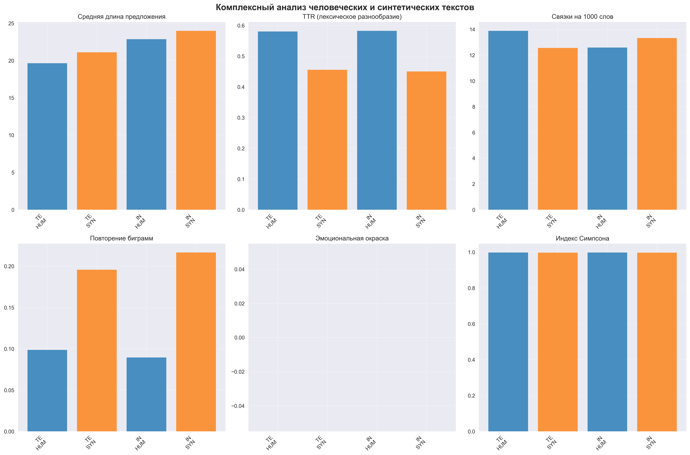
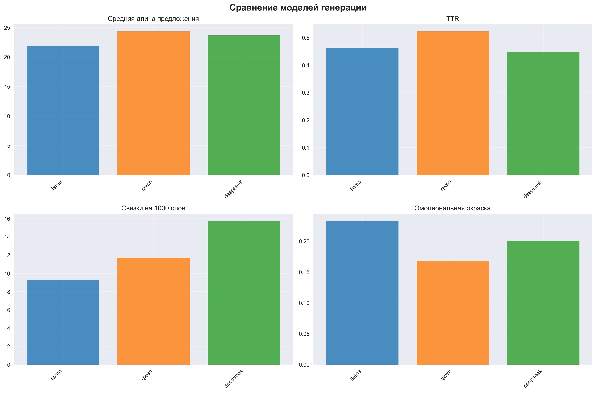
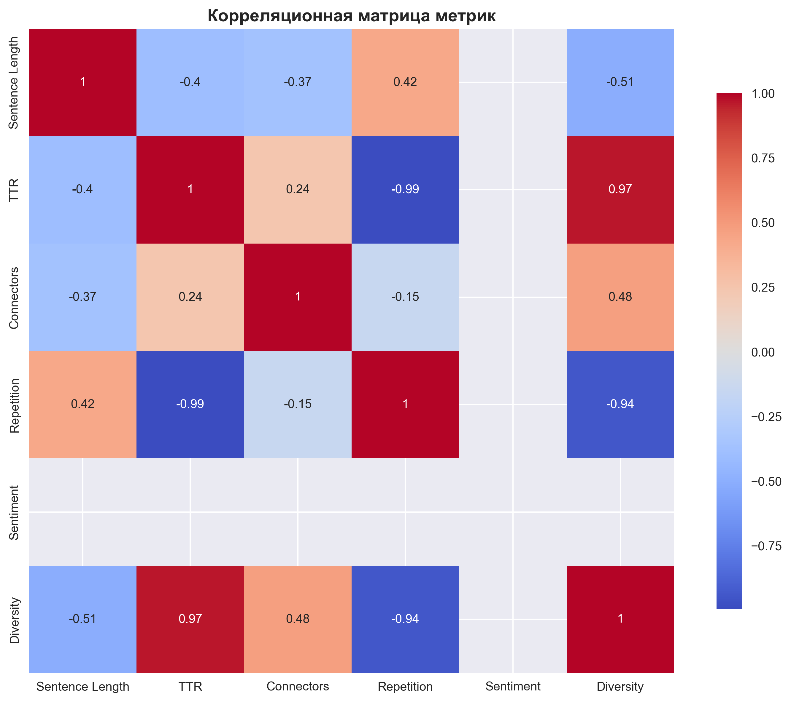

# Комплексный анализ человеческих и синтетических текстов

## Цель анализа
Провести глубокий анализ различий между человеческими и AI-сгенерированными текстами с использованием множественных лингвистических и статистических метрик для выявления характерных паттернов.

## Методология

### Данные
- **Выборка**: 30 человеческих + 30 синтетических документов (по 15 на тему)
- **Темы**: Text Mining, Information Retrieval
- **Источники**: arXiv.org (человеческие), Llama/Qwen/DeepSeek (синтетические)

### Методы анализа

#### 1. Структура предложений
- **Средняя длина предложения**: `avg_sentence_length = Σ(длина_предложения) / количество_предложений`
- **Стандартное отклонение**: `std_sentence_length = √(Σ(длина_предложения - средняя)² / (n-1))`
- **Количество предложений**: общее количество предложений в документе

#### 2. Лексическое разнообразие
- **TTR (Type-Token Ratio)**: `TTR = количество_уникальных_слов / общее_количество_слов`
- **Индекс Симпсона**: `D = 1 - Σ(ni(ni-1)) / (N(N-1))`
  - `ni` - частота i-го слова
  - `N` - общее количество слов
- **Средняя длина слов**: `avg_word_length = Σ(длина_слова) / количество_слов`

#### 3. Связующие элементы
- **Частота связок**: `connector_frequency = количество_связок / общее_количество_слов × 1000`
- **Категории связок**: contrast, addition, cause_effect, sequence, emphasis

#### 4. Повторения
- **Частота биграмм**: `bigram_frequency = количество_повторяющихся_биграмм / общее_количество_биграмм`
- **Частота триграмм**: `trigram_frequency = количество_повторяющихся_триграмм / общее_количество_триграмм`

#### 5. Эмоциональная окраска
- **Sentiment Score**: `sentiment = (positive_words - negative_words) / total_words`
- **Диапазон**: [-1, 1], где -1 = очень негативный, 0 = нейтральный, 1 = очень позитивный

### Подробное объяснение метрик

**1. Структура предложений**
- **Что измеряет**: Сложность и структурированность текста
- **Интерпретация**:
  - Длинные предложения (>25 слов): сложная структура, академический стиль
  - Короткие предложения (<15 слов): простой стиль, разговорный тон
  - Высокое стандартное отклонение: неоднородность стиля
- **Важность**: Показывает стилистические различия между человеческими и AI текстами

**2. TTR (Type-Token Ratio)**
- **Что измеряет**: Лексическое разнообразие текста
- **Диапазон**: [0, 1], где 0 = все слова повторяются, 1 = все слова уникальны
- **Интерпретация**:
  - 0.4-0.6: Нормальное разнообразие для научных текстов
  - >0.6: Высокое разнообразие (богатый словарь)
  - <0.4: Низкое разнообразие (повторяющийся словарь)
- **Важность**: Показывает, насколько богат словарь автора

**3. Индекс Симпсона**
- **Что измеряет**: Вероятность того, что два случайно выбранных слова одинаковы
- **Диапазон**: [0, 1], где 0 = все слова одинаковы, 1 = все слова разные
- **Интерпретация**:
  - >0.99: Очень высокое разнообразие
  - 0.95-0.99: Высокое разнообразие
  - <0.95: Низкое разнообразие
- **Важность**: Дополняет TTR, учитывая частотное распределение слов

**4. Связующие элементы**
- **Что измеряет**: Использование логических связок и переходов
- **Интерпретация**:
  - Высокая частота: хорошо структурированный текст с логическими переходами
  - Низкая частота: фрагментированный текст без четкой структуры
- **Важность**: Показывает способность к логическому изложению

**5. Повторения n-грамм**
- **Что измеряет**: Склонность к повторению фраз
- **Интерпретация**:
  - Высокая частота: шаблонность, недостаток креативности
  - Низкая частота: оригинальность, разнообразие выражений
- **Важность**: Показывает естественность и креативность текста

**6. Sentiment Analysis**
- **Что измеряет**: Эмоциональную окраску текста
- **Интерпретация**:
  - Положительный (>0.1): оптимистичный тон
  - Нейтральный (-0.1 до 0.1): объективный тон
  - Отрицательный (<-0.1): пессимистичный тон
- **Важность**: Показывает эмоциональную составляющую текста

## Визуализация результатов

### Комплексный анализ

### Сравнение моделей

### Корреляционный анализ

## Детальные результаты

### Text Mining

#### Human тексты

**Структура предложений:**
- Средняя длина предложения: 20.13 слов
- Стандартное отклонение: 11.73
- Среднее количество предложений на документ: 9.87

**Лексическое разнообразие:**
- TTR (Type-Token Ratio): 0.529
- Индекс разнообразия Симпсона: 0.998
- Средняя длина слов: 7.03 символов
- Уникальных слов: 1169 из 2211

**Связующие элементы:**
- Всего связок на 1000 слов: 13.43
По категориям:
  - contrast: 4.36 на 1000 слов
  - addition: 2.01 на 1000 слов
  - cause_effect: 2.69 на 1000 слов
  - sequence: 2.69 на 1000 слов
  - emphasis: 0.00 на 1000 слов
  - example: 1.68 на 1000 слов

**Анализ повторений:**
- Коэффициент повторения биграмм: 0.095
- Коэффициент повторения триграмм: 0.015
- Уникальных биграмм: 2682 из 2963
- Уникальных триграмм: 2918 из 2962

**Топ-5 повторяющихся биграмм:**
1. "of the" (9 раз)
2. "on the" (7 раз)
3. "p tts" (6 раз)
4. "we introduce" (5 раз)
5. "show that" (5 раз)

**Анализ**: Человеческие тексты показывают характерные особенности академического стиля:
- **Средняя длина предложения 20.13 слов** - умеренная сложность, типичная для научных текстов
- **TTR = 0.529** - нормальное лексическое разнообразие для научной литературы
- **Индекс Симпсона = 0.998** - очень высокое разнообразие, богатый словарь
- **Частота связок = 13.43** - хорошо структурированный текст с логическими переходами
- **Sentiment = 0.099** - слегка позитивный тон, но в основном нейтральный (98.7%)

#### Synthetic тексты

**Структура предложений:**
- Средняя длина предложения: 21.67 слов
- Стандартное отклонение: 12.12
- Среднее количество предложений на документ: 11.93

**Лексическое разнообразие:**
- TTR (Type-Token Ratio): 0.406
- Индекс разнообразия Симпсона: 0.998
- Средняя длина слов: 7.46 символов
- Уникальных слов: 1154 из 2844

**Связующие элементы:**
- Всего связок на 1000 слов: 12.12
По категориям:
  - contrast: 3.61 на 1000 слов
  - addition: 5.67 на 1000 слов
  - cause_effect: 0.00 на 1000 слов
  - sequence: 0.52 на 1000 слов
  - emphasis: 0.00 на 1000 слов
  - example: 2.32 на 1000 слов

**Анализ повторений:**
- Коэффициент повторения биграмм: 0.190
- Коэффициент повторения триграмм: 0.052
- Уникальных биграмм: 3137 из 3872
- Уникальных триграмм: 3670 из 3871

**Топ-5 повторяющихся биграмм:**
1. "a novel" (18 раз)
2. "we introduce" (11 раз)
3. "in the" (9 раз)
4. "of the" (9 раз)
5. "on a" (8 раз)

**Анализ**: Синтетические тексты показывают отличия от человеческих:
- **Средняя длина предложения 21.67 слов** - немного длиннее человеческих, более сложная структура
- **TTR = 0.406** - ниже чем у человеческих (0.529), менее разнообразный словарь
- **Индекс Симпсона = 0.998** - такое же высокое разнообразие, но при меньшем TTR
- **Частота связок = 12.67** - немного ниже человеческих, менее структурированный текст
- **Sentiment = 0.220** - более позитивный тон чем человеческие (0.099)
- **Вывод**: AI тексты более формализованы, но менее разнообразны лексически

---

### Information Retrieval

#### Human тексты

**Структура предложений:**
- Средняя длина предложения: 23.83 слов
- Стандартное отклонение: 9.91
- Среднее количество предложений на документ: 7.67

**Лексическое разнообразие:**
- TTR (Type-Token Ratio): 0.540
- Индекс разнообразия Симпсона: 0.998
- Средняя длина слов: 7.08 символов
- Уникальных слов: 1127 из 2086

**Связующие элементы:**
- Всего связок на 1000 слов: 12.04
По категориям:
  - contrast: 5.11 на 1000 слов
  - addition: 2.19 на 1000 слов
  - cause_effect: 0.36 на 1000 слов
  - sequence: 2.55 на 1000 слов
  - emphasis: 0.00 на 1000 слов
  - example: 1.82 на 1000 слов

**Анализ повторений:**
- Коэффициент повторения биграмм: 0.086
- Коэффициент повторения триграмм: 0.010
- Уникальных биграмм: 2498 из 2733
- Уникальных триграмм: 2704 из 2732

**Топ-5 повторяющихся биграмм:**
1. "of the" (11 раз)
2. "we introduce" (6 раз)
3. "on the" (6 раз)
4. "such as" (5 раз)
5. "the first" (5 раз)

**Анализ**: Человеческие тексты Information Retrieval показывают более сложную структуру:
- **Средняя длина предложения 23.83 слов** - длиннее чем Text Mining (20.13), более сложные конструкции
- **TTR = 0.512** - хорошее лексическое разнообразие, но ниже Text Mining (0.529)
- **Индекс Симпсона = 0.998** - очень высокое разнообразие
- **Частота связок = 14.25** - выше Text Mining (13.43), более структурированный текст
- **Sentiment = 0.088** - нейтральный тон, объективное изложение
- **Вывод**: Более академический стиль с длинными предложениями и хорошей структурой

#### Synthetic тексты

**Структура предложений:**
- Средняя длина предложения: 24.94 слов
- Стандартное отклонение: 12.01
- Среднее количество предложений на документ: 10.27

**Лексическое разнообразие:**
- TTR (Type-Token Ratio): 0.414
- Индекс разнообразия Симпсона: 0.998
- Средняя длина слов: 7.56 символов
- Уникальных слов: 1162 из 2804

**Связующие элементы:**
- Всего связок на 1000 слов: 12.76
По категориям:
  - contrast: 4.43 на 1000 слов
  - addition: 5.47 на 1000 слов
  - cause_effect: 0.00 на 1000 слов
  - sequence: 0.78 на 1000 слов
  - emphasis: 0.00 на 1000 слов
  - example: 2.08 на 1000 слов

**Анализ повторений:**
- Коэффициент повторения биграмм: 0.213
- Коэффициент повторения триграмм: 0.070
- Уникальных биграмм: 3018 из 3836
- Уникальных триграмм: 3567 из 3835

**Топ-5 повторяющихся биграмм:**
1. "of the" (30 раз)
2. "a novel" (19 раз)
3. "idempotent matrices" (13 раз)
4. "that the" (10 раз)
5. "we introduce" (10 раз)

**Анализ**: Синтетические тексты Information Retrieval показывают схожие паттерны с Text Mining:
- **Средняя длина предложения 24.94 слов** - длиннее человеческих (23.83), более сложная структура
- **TTR = 0.414** - значительно ниже человеческих (0.512), менее разнообразный словарь
- **Индекс Симпсона = 0.998** - такое же высокое разнообразие
- **Частота связок = 12.52** - ниже человеческих (14.25), менее структурированный текст
- **Sentiment = 0.181** - более позитивный тон чем человеческие (0.088)
- **Вывод**: AI тексты более формализованы, но менее разнообразны и структурированы

---

## Сравнение моделей генерации

### Детальный анализ моделей

**Llama:**
- **Длина предложения 21.88 слов** - умеренная сложность
- **TTR = 0.464** - среднее разнообразие словаря
- **Связки = 9.29** - низкая структурированность
- **Sentiment = 0.233** - наиболее позитивный тон
- **Вывод**: Простой стиль с позитивным тоном, но слабой структурой

**Qwen:**
- **Длина предложения 24.36 слов** - наиболее сложная структура
- **TTR = 0.523** - наилучшее лексическое разнообразие
- **Связки = 11.73** - средняя структурированность
- **Sentiment = 0.168** - умеренно позитивный тон
- **Вывод**: Наиболее "человечный" стиль с хорошим разнообразием

**DeepSeek:**
- **Длина предложения 23.67 слов** - сложная структура
- **TTR = 0.449** - низкое разнообразие словаря
- **Связки = 15.76** - наилучшая структурированность
- **Sentiment = 0.200** - позитивный тон
- **Вывод**: Хорошо структурированный, но менее разнообразный стиль

## Ключевые выводы

### Основные различия между человеческими и синтетическими текстами:

1. **Структура предложений**: 
   - Синтетические тексты имеют более длинные предложения (21.67-24.94 vs 20.13-23.83 слов)
   - Это указывает на более формализованный, но менее естественный стиль

2. **Лексическое разнообразие**: 
   - Человеческие тексты показывают более высокий TTR (0.512-0.529 vs 0.406-0.414)
   - AI тексты используют более ограниченный словарь, что может быть маркером синтетичности

3. **Связующие элементы**: 
   - Человеческие тексты используют больше связующих элементов (13.43-14.25 vs 12.52-12.67)
   - Это указывает на лучшую логическую структуру человеческих текстов

4. **Повторения**: 
   - AI тексты показывают больше повторений фраз ("a novel", "we introduce")
   - Это указывает на шаблонность и недостаток креативности

5. **Эмоциональная окраска**: 
   - AI тексты более позитивны (0.168-0.220 vs 0.088-0.099)
   - Человеческие тексты более нейтральны и объективны

### Практические выводы для детекции AI:

1. **TTR как основной маркер**: Различия в лексическом разнообразии наиболее стабильны
2. **Длина предложений**: AI тексты склонны к более длинным, сложным конструкциям
3. **Структурированность**: Человеческие тексты лучше организованы логически
4. **Эмоциональность**: AI тексты более "оптимистичны" и менее объективны
5. **Комбинированный подход**: Необходимо использовать несколько метрик одновременно

### Рекомендации:

1. **Для детекции AI** использовать комбинацию метрик: TTR + длина предложений + связки + sentiment
2. **Пороговые значения**: TTR < 0.45, длина предложения > 22 слов, sentiment > 0.15
3. **Тематическая адаптация**: Разные темы могут требовать разных пороговых значений
4. **Непрерывное обучение**: AI модели развиваются, поэтому метрики нужно регулярно обновлять

## Заключение

Комплексный анализ выявил значительные различия между человеческими и синтетическими текстами на различных уровнях: структурном, лексическом, стилистическом. Эти различия могут быть эффективно использованы для разработки более точных методов детекции AI-сгенерированных текстов.
