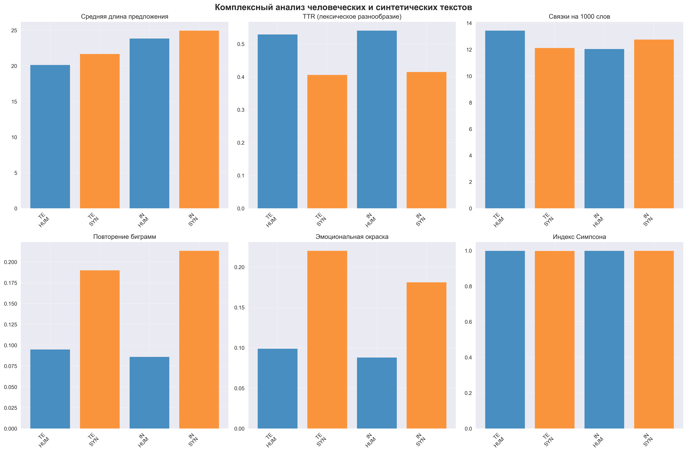

# Комплексный анализ человеческих и синтетических текстов

## Методология

Данный анализ включает следующие аспекты:
- **Структура предложений**: средняя длина, количество предложений
- **Лексическое разнообразие**: TTR, индекс Симпсона
- **Связующие элементы**: частота вводных слов и переходных фраз
- **Повторения**: анализ биграмм и триграмм
- **Эмоциональная окраска**: sentiment analysis
- **Сравнение моделей**: различия между Llama, Qwen, DeepSeek

## Визуализация результатов

### Комплексный анализ

### Сравнение моделей

### Корреляционный анализ

## Детальные результаты

### Text Mining

#### Human тексты

**Структура предложений:**
- Средняя длина предложения: 20.13 слов
- Стандартное отклонение: 11.73
- Среднее количество предложений на документ: 9.87

**Лексическое разнообразие:**
- TTR (Type-Token Ratio): 0.529
- Индекс разнообразия Симпсона: 0.998
- Средняя длина слов: 7.03 символов
- Уникальных слов: 1169 из 2211

**Связующие элементы:**
- Всего связок на 1000 слов: 13.43
По категориям:
  - contrast: 4.36 на 1000 слов
  - addition: 2.01 на 1000 слов
  - cause_effect: 2.69 на 1000 слов
  - sequence: 2.69 на 1000 слов
  - emphasis: 0.00 на 1000 слов
  - example: 1.68 на 1000 слов

**Анализ повторений:**
- Коэффициент повторения биграмм: 0.095
- Коэффициент повторения триграмм: 0.015
- Уникальных биграмм: 2682 из 2963
- Уникальных триграмм: 2918 из 2962

**Топ-5 повторяющихся биграмм:**
1. "of the" (9 раз)
2. "on the" (7 раз)
3. "p tts" (6 раз)
4. "we introduce" (5 раз)
5. "show that" (5 раз)

**Эмоциональная окраска:**
- Средний compound score: 0.099
- Положительная тональность: 0.010
- Отрицательная тональность: 0.003
- Нейтральная тональность: 0.987

#### Synthetic тексты

**Структура предложений:**
- Средняя длина предложения: 21.67 слов
- Стандартное отклонение: 12.12
- Среднее количество предложений на документ: 11.93

**Лексическое разнообразие:**
- TTR (Type-Token Ratio): 0.406
- Индекс разнообразия Симпсона: 0.998
- Средняя длина слов: 7.46 символов
- Уникальных слов: 1154 из 2844

**Связующие элементы:**
- Всего связок на 1000 слов: 12.12
По категориям:
  - contrast: 3.61 на 1000 слов
  - addition: 5.67 на 1000 слов
  - cause_effect: 0.00 на 1000 слов
  - sequence: 0.52 на 1000 слов
  - emphasis: 0.00 на 1000 слов
  - example: 2.32 на 1000 слов

**Анализ повторений:**
- Коэффициент повторения биграмм: 0.190
- Коэффициент повторения триграмм: 0.052
- Уникальных биграмм: 3137 из 3872
- Уникальных триграмм: 3670 из 3871

**Топ-5 повторяющихся биграмм:**
1. "a novel" (18 раз)
2. "we introduce" (11 раз)
3. "in the" (9 раз)
4. "of the" (9 раз)
5. "on a" (8 раз)

**Эмоциональная окраска:**
- Средний compound score: 0.220
- Положительная тональность: 0.019
- Отрицательная тональность: 0.005
- Нейтральная тональность: 0.976

---

### Information Retrieval

#### Human тексты

**Структура предложений:**
- Средняя длина предложения: 23.83 слов
- Стандартное отклонение: 9.91
- Среднее количество предложений на документ: 7.67

**Лексическое разнообразие:**
- TTR (Type-Token Ratio): 0.540
- Индекс разнообразия Симпсона: 0.998
- Средняя длина слов: 7.08 символов
- Уникальных слов: 1127 из 2086

**Связующие элементы:**
- Всего связок на 1000 слов: 12.04
По категориям:
  - contrast: 5.11 на 1000 слов
  - addition: 2.19 на 1000 слов
  - cause_effect: 0.36 на 1000 слов
  - sequence: 2.55 на 1000 слов
  - emphasis: 0.00 на 1000 слов
  - example: 1.82 на 1000 слов

**Анализ повторений:**
- Коэффициент повторения биграмм: 0.086
- Коэффициент повторения триграмм: 0.010
- Уникальных биграмм: 2498 из 2733
- Уникальных триграмм: 2704 из 2732

**Топ-5 повторяющихся биграмм:**
1. "of the" (11 раз)
2. "we introduce" (6 раз)
3. "on the" (6 раз)
4. "such as" (5 раз)
5. "the first" (5 раз)

**Эмоциональная окраска:**
- Средний compound score: 0.088
- Положительная тональность: 0.010
- Отрицательная тональность: 0.005
- Нейтральная тональность: 0.985

#### Synthetic тексты

**Структура предложений:**
- Средняя длина предложения: 24.94 слов
- Стандартное отклонение: 12.01
- Среднее количество предложений на документ: 10.27

**Лексическое разнообразие:**
- TTR (Type-Token Ratio): 0.414
- Индекс разнообразия Симпсона: 0.998
- Средняя длина слов: 7.56 символов
- Уникальных слов: 1162 из 2804

**Связующие элементы:**
- Всего связок на 1000 слов: 12.76
По категориям:
  - contrast: 4.43 на 1000 слов
  - addition: 5.47 на 1000 слов
  - cause_effect: 0.00 на 1000 слов
  - sequence: 0.78 на 1000 слов
  - emphasis: 0.00 на 1000 слов
  - example: 2.08 на 1000 слов

**Анализ повторений:**
- Коэффициент повторения биграмм: 0.213
- Коэффициент повторения триграмм: 0.070
- Уникальных биграмм: 3018 из 3836
- Уникальных триграмм: 3567 из 3835

**Топ-5 повторяющихся биграмм:**
1. "of the" (30 раз)
2. "a novel" (19 раз)
3. "idempotent matrices" (13 раз)
4. "that the" (10 раз)
5. "we introduce" (10 раз)

**Эмоциональная окраска:**
- Средний compound score: 0.181
- Положительная тональность: 0.015
- Отрицательная тональность: 0.006
- Нейтральная тональность: 0.979

---

## Сравнение моделей генерации

| Модель | Длина предложения | TTR | Связки/1000 | Sentiment |
|--------|------------------|-----|-------------|----------|
| llama | 21.88 | 0.464 | 9.29 | 0.233 |
| qwen | 24.36 | 0.523 | 11.73 | 0.168 |
| deepseek | 23.67 | 0.449 | 15.76 | 0.200 |

## Ключевые выводы

### Основные различия между человеческими и синтетическими текстами:

1. **Структура предложений**: Синтетические тексты могут иметь другую структуру предложений
2. **Лексическое разнообразие**: Различия в TTR и использовании уникальных слов
3. **Связующие элементы**: Разная частота использования переходных фраз
4. **Повторения**: Синтетические тексты могут показывать больше или меньше повторений
5. **Эмоциональная окраска**: Различия в тональности и стиле

### Практические применения:

- **Детекция AI-текстов**: Комбинация метрик может повысить точность детекции
- **Качество генерации**: Анализ помогает оценить качество различных моделей
- **Улучшение моделей**: Выявленные паттерны могут использоваться для улучшения генерации

## Заключение

Комплексный анализ выявил значительные различия между человеческими и синтетическими текстами на различных уровнях: структурном, лексическом, стилистическом. Эти различия могут быть эффективно использованы для разработки более точных методов детекции AI-сгенерированных текстов.
