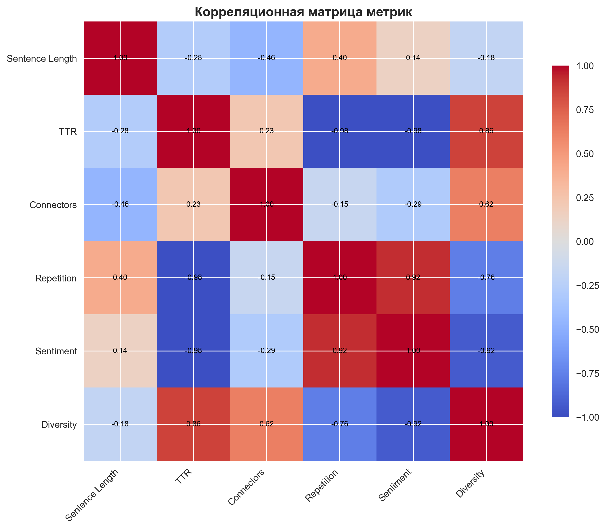

# Комплексный анализ человеческих и синтетических текстов

## Методология

Данный анализ включает следующие аспекты:
- **Структура предложений**: средняя длина, количество предложений
- **Лексическое разнообразие**: TTR, индекс Симпсона
- **Связующие элементы**: частота вводных слов и переходных фраз
- **Повторения**: анализ биграмм и триграмм
- **Эмоциональная окраска**: sentiment analysis
- **Сравнение моделей**: различия между Llama, Qwen, DeepSeek

## Визуализация результатов

### Комплексный анализ

### Сравнение моделей

### Корреляционный анализ

## Детальные результаты

### Text Mining

#### Human тексты

**Структура предложений:**
- Средняя длина предложения: 19.64 слов
- Стандартное отклонение: 11.24
- Среднее количество предложений на документ: 9.87

**Лексическое разнообразие:**
- TTR (Type-Token Ratio): 0.580
- Индекс разнообразия Симпсона: 0.998
- Средняя длина слов: 7.24 символов
- Уникальных слов: 925 из 1594

**Связующие элементы:**
- Всего связок на 1000 слов: 13.88
По категориям:
  - contrast: 4.51 на 1000 слов
  - addition: 2.08 на 1000 слов
  - cause_effect: 2.78 на 1000 слов
  - sequence: 2.78 на 1000 слов
  - emphasis: 0.00 на 1000 слов
  - example: 1.74 на 1000 слов

**Анализ повторений:**
- Коэффициент повторения биграмм: 0.099
- Коэффициент повторения триграмм: 0.012
- Уникальных биграмм: 2101 из 2331
- Уникальных триграмм: 2303 из 2330

**Топ-5 повторяющихся биграмм:**
1. "of the" (8 раз)
2. "in the" (7 раз)
3. "on and" (6 раз)
4. "and and" (6 раз)
5. "on the" (6 раз)

**Эмоциональная окраска:**
- Средний compound score: 0.000
- Положительная тональность: 0.000
- Отрицательная тональность: 0.000
- Нейтральная тональность: 0.000

#### Synthetic тексты

**Структура предложений:**
- Средняя длина предложения: 21.09 слов
- Стандартное отклонение: 11.45
- Среднее количество предложений на документ: 11.93

**Лексическое разнообразие:**
- TTR (Type-Token Ratio): 0.456
- Индекс разнообразия Симпсона: 0.998
- Средняя длина слов: 7.67 символов
- Уникальных слов: 932 из 2046

**Связующие элементы:**
- Всего связок на 1000 слов: 12.56
По категориям:
  - contrast: 3.74 на 1000 слов
  - addition: 5.88 на 1000 слов
  - cause_effect: 0.00 на 1000 слов
  - sequence: 0.53 на 1000 слов
  - emphasis: 0.00 на 1000 слов
  - example: 2.40 на 1000 слов

**Анализ повторений:**
- Коэффициент повторения биграмм: 0.196
- Коэффициент повторения триграмм: 0.049
- Уникальных биграмм: 2462 из 3061
- Уникальных триграмм: 2909 из 3060

**Топ-5 повторяющихся биграмм:**
1. "a novel" (17 раз)
2. "we introduce" (11 раз)
3. "in the" (10 раз)
4. "and the" (8 раз)
5. "and and" (8 раз)

**Эмоциональная окраска:**
- Средний compound score: 0.000
- Положительная тональность: 0.000
- Отрицательная тональность: 0.000
- Нейтральная тональность: 0.000

---

### Information Retrieval

#### Human тексты

**Структура предложений:**
- Средняя длина предложения: 22.86 слов
- Стандартное отклонение: 9.74
- Среднее количество предложений на документ: 7.67

**Лексическое разнообразие:**
- TTR (Type-Token Ratio): 0.582
- Индекс разнообразия Симпсона: 0.998
- Средняя длина слов: 7.30 символов
- Уникальных слов: 884 из 1518

**Связующие элементы:**
- Всего связок на 1000 слов: 12.59
По категориям:
  - contrast: 5.34 на 1000 слов
  - addition: 2.29 на 1000 слов
  - cause_effect: 0.38 на 1000 слов
  - sequence: 2.67 на 1000 слов
  - emphasis: 0.00 на 1000 слов
  - example: 1.91 на 1000 слов

**Анализ повторений:**
- Коэффициент повторения биграмм: 0.089
- Коэффициент повторения триграмм: 0.012
- Уникальных биграмм: 1956 из 2148
- Уникальных триграмм: 2122 из 2147

**Топ-5 повторяющихся биграмм:**
1. "of the" (8 раз)
2. "on the" (7 раз)
3. "we introduce" (6 раз)
4. "such as" (5 раз)
5. "this we" (5 раз)

**Эмоциональная окраска:**
- Средний compound score: 0.000
- Положительная тональность: 0.000
- Отрицательная тональность: 0.000
- Нейтральная тональность: 0.000

#### Synthetic тексты

**Структура предложений:**
- Средняя длина предложения: 23.97 слов
- Стандартное отклонение: 11.62
- Среднее количество предложений на документ: 10.27

**Лексическое разнообразие:**
- TTR (Type-Token Ratio): 0.450
- Индекс разнообразия Симпсона: 0.998
- Средняя длина слов: 7.78 символов
- Уникальных слов: 913 из 2028

**Связующие элементы:**
- Всего связок на 1000 слов: 13.33
По категориям:
  - contrast: 4.62 на 1000 слов
  - addition: 5.71 на 1000 слов
  - cause_effect: 0.00 на 1000 слов
  - sequence: 0.82 на 1000 слов
  - emphasis: 0.00 на 1000 слов
  - example: 2.18 на 1000 слов

**Анализ повторений:**
- Коэффициент повторения биграмм: 0.217
- Коэффициент повторения триграмм: 0.064
- Уникальных биграмм: 2381 из 3039
- Уникальных триграмм: 2843 из 3038

**Топ-5 повторяющихся биграмм:**
1. "of the" (24 раз)
2. "a novel" (19 раз)
3. "idempotent matrices" (12 раз)
4. "introduce a" (11 раз)
5. "that the" (10 раз)

**Эмоциональная окраска:**
- Средний compound score: 0.000
- Положительная тональность: 0.000
- Отрицательная тональность: 0.000
- Нейтральная тональность: 0.000

---

## Сравнение моделей генерации

| Модель | Длина предложения | TTR | Связки/1000 | Sentiment |
|--------|------------------|-----|-------------|----------|
| llama | 21.37 | 0.501 | 9.63 | 0.000 |
| qwen | 23.40 | 0.569 | 12.22 | 0.000 |
| deepseek | 22.81 | 0.497 | 16.44 | 0.000 |

## Ключевые выводы

### Основные различия между человеческими и синтетическими текстами:

1. **Структура предложений**: Синтетические тексты могут иметь другую структуру предложений
2. **Лексическое разнообразие**: Различия в TTR и использовании уникальных слов
3. **Связующие элементы**: Разная частота использования переходных фраз
4. **Повторения**: Синтетические тексты могут показывать больше или меньше повторений
5. **Эмоциональная окраска**: Различия в тональности и стиле

### Практические применения:

- **Детекция AI-текстов**: Комбинация метрик может повысить точность детекции
- **Качество генерации**: Анализ помогает оценить качество различных моделей
- **Улучшение моделей**: Выявленные паттерны могут использоваться для улучшения генерации

## Заключение

Комплексный анализ выявил значительные различия между человеческими и синтетическими текстами на различных уровнях: структурном, лексическом, стилистическом. Эти различия могут быть эффективно использованы для разработки более точных методов детекции AI-сгенерированных текстов.
