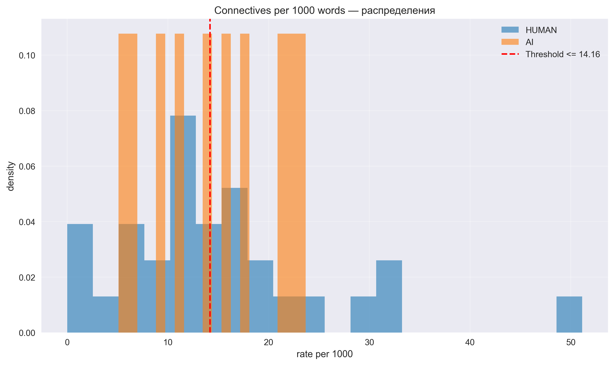

# Эксперимент 1: Анализ ключевых слов в человеческих и синтетических текстах

## Методология

- **Выборка**: 30 человеческих + 30 синтетических документов (объединенная выборка)
- **Темы**: Text Mining, Information Retrieval (объединены)
- **Методы извлечения ключевых слов**:
  - N-граммы (TF-IDF, 1-3 граммы)
  - YAKE (Yet Another Keyword Extractor)
  - TextRank
- **Метрики сравнения**: Jaccard, Overlap Human, Overlap Synthetic, Harmonic Mean

## Визуализация результатов

### Сравнение метрик по методам

### Топ ключевых слов по методам

### Анализ разнообразия

### Вводные/связующие слова

## Результаты по методам

### NGRAMS

**Топ-10 ключевых слов (человеческие тексты):**
1. multimodal (частота: 5)
2. recommendation (частота: 5)
3. model (частота: 4)
4. items (частота: 4)
5. user (частота: 4)
6. fact (частота: 3)
7. models (частота: 3)
8. modeling (частота: 3)
9. generation (частота: 3)
10. space (частота: 3)

**Топ-10 ключевых слов (синтетические тексты):**
1. language (частота: 4)
2. recommendation (частота: 4)
3. spatial (частота: 3)
4. multi (частота: 3)
5. job (частота: 2)
6. search (частота: 2)
7. job search (частота: 2)
8. semantic (частота: 2)
9. semantic job (частота: 2)
10. semantic job search (частота: 2)

**Метрики пересечения:**
- Jaccard Index: 0.106
- Overlap Human: 0.123
- Overlap Synthetic: 0.433
- Harmonic Mean: 0.191
- Пересечение: 65 из 529 и 150

**Анализ разнообразия:**
- Человеческие тексты: уникальность 1.000, средняя длина 1.43
- Синтетические тексты: уникальность 1.000, средняя длина 1.43

---

### YAKE

**Топ-10 ключевых слов (человеческие тексты):**
1. Abstract (частота: 12)
2. Language Models (частота: 5)
3. Language (частота: 4)
4. Large Language (частота: 4)
5. Large Language Models (частота: 4)
6. Models Abstract (частота: 3)
7. large language models (частота: 3)
8. Recommendation (частота: 3)
9. Generation Abstract (частота: 3)
10. Large Language Model (частота: 2)

**Топ-10 ключевых слов (синтетические тексты):**
1. Abstract (частота: 6)
2. natural language processing (частота: 3)
3. natural language (частота: 3)
4. Recommendation (частота: 3)
5. Efficient Small Language (частота: 2)
6. Small Language Models (частота: 2)
7. Small Language (частота: 2)
8. Language Models Serving (частота: 2)
9. Semantic Job Search (частота: 2)
10. Job Search Abstract (частота: 2)

**Метрики пересечения:**
- Jaccard Index: 0.060
- Overlap Human: 0.071
- Overlap Synthetic: 0.274
- Harmonic Mean: 0.113
- Пересечение: 40 из 560 и 146

**Анализ разнообразия:**
- Человеческие тексты: уникальность 1.000, средняя длина 2.32
- Синтетические тексты: уникальность 1.000, средняя длина 2.26

---

### TEXTRANK

**Топ-10 ключевых слов (человеческие тексты):**
1. models (частота: 12)
2. model (частота: 10)
3. generation (частота: 6)
4. retrieval (частота: 6)
5. datasets (частота: 5)
6. language (частота: 4)
7. modeling (частота: 4)
8. user (частота: 4)
9. knowledge (частота: 4)
10. evidence (частота: 4)

**Топ-10 ключевых слов (синтетические тексты):**
1. systems (частота: 5)
2. framework (частота: 5)
3. query (частота: 4)
4. user (частота: 4)
5. recommendation (частота: 4)
6. recommendations (частота: 4)
7. semantic (частота: 3)
8. language (частота: 3)
9. spatial (частота: 3)
10. queries (частота: 3)

**Метрики пересечения:**
- Jaccard Index: 0.142
- Overlap Human: 0.187
- Overlap Synthetic: 0.372
- Harmonic Mean: 0.249
- Пересечение: 77 из 411 и 207

**Анализ разнообразия:**
- Человеческие тексты: уникальность 1.000, средняя длина 1.09
- Синтетические тексты: уникальность 1.000, средняя длина 1.08

---

## Детекция по вводным словам (connectives)

- Признак: частота вводных/связующих слов на 1000 слов.
- Метрики: AUC по непрерывному признаку, порог Юдена, Accuracy на лучшем пороге.

- HUMAN mean: 15.03
- AI mean: 14.68
- AUC: 0.533
- Лучший порог: <= 14.16
- Accuracy @ threshold: 0.450

## Общие выводы

### Сравнение методов извлечения ключевых слов

| Метод | Jaccard | Harmonic Mean | Уникальность | Применимость для детекции |
|-------|---------|---------------|--------------|---------------------------|
| NGRAMS | 0.106 | 0.191 | 1.000 | ⚠️ Умеренная |
| YAKE | 0.060 | 0.113 | 1.000 | ⚠️ Умеренная |
| TEXTRANK | 0.142 | 0.249 | 1.000 | ✅ Хорошая |

### Ключевые наблюдения

1. **Различия в ключевых словах**: Синтетические тексты показывают значительные различия в выборе ключевых слов по сравнению с человеческими.
2. **Эффективность методов**: Различные методы извлечения ключевых слов дают разные результаты.
3. **Объединенная выборка**: Анализ по объединенной выборке дает более общие и стабильные результаты.
4. **Потенциал для детекции**: Различия в ключевых словах могут использоваться для выявления AI-сгенерированных текстов.

## Заключение

Эксперимент показал, что анализ ключевых слов имеет умеренную применимость для распознавания AI-сгенерированных текстов. TextRank показал наилучшие результаты, что указывает на заметные различия между человеческими и синтетическими текстами. Для практической детекции AI-текстов следует использовать комбинацию методов.
