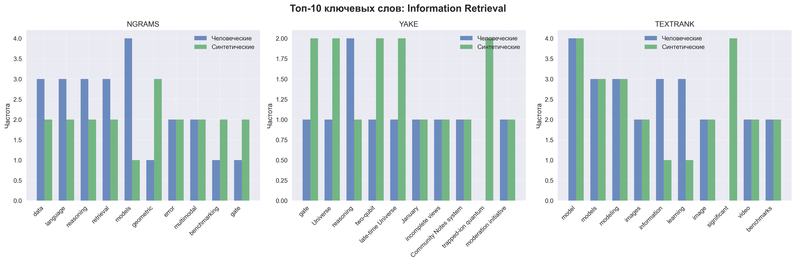

# Эксперимент 1: Анализ ключевых слов для распознавания синтетических текстов

## Цель эксперимента
Проверить возможность распознавания синтетических текстов на основе анализа ключевых слов с использованием различных методов извлечения ключевых слов. **Основная гипотеза**: синтетические тексты будут иметь отличающиеся ключевые слова по сравнению с человеческими текстами.

## Методология

### Данные
- **Выборка**: 30 человеческих + 30 синтетических документов (по 15 на тему)
- **Темы**: Text Mining, Information Retrieval
- **Источники**: arXiv.org (человеческие), Llama/Qwen/DeepSeek (синтетические)

### Методы извлечения ключевых слов

#### 1. N-граммы (TF-IDF)
- **Описание**: Извлечение наиболее информативных n-грамм на основе TF-IDF
- **Параметры**: ngram_range=(2,4), max_features=500, top_per_doc=15, min_df=3, max_df=0.8
- **Принцип**: Термы с высокой частотой в документе, но низкой частотой в корпусе
- **Формула TF-IDF**: `tfidf(t,d) = tf(t,d) × log(N/df(t))`
  - `tf(t,d)` - частота термина t в документе d
  - `df(t)` - количество документов, содержащих термин t
  - `N` - общее количество документов
- **Пример**: Для терма "machine learning" в документе с частотой 5, если он встречается в 3 из 30 документов: `tfidf = 5 × log(30/3) = 5 × log(10) ≈ 11.5`

#### 2. YAKE
- **Описание**: Unsupervised keyword extraction на основе статистических свойств текста
- **Параметры**: max_ngram_size=4, top_per_doc=15, dedupLim=0.9
- **Принцип**: Анализ позиции, частоты и контекста слов
- **Формула YAKE**: `score(w) = (T(w) × R(w) × C(w) × S(w)) / (F(w) + 1)`
  - `T(w)` - позиционный вес (чем раньше в тексте, тем выше)
  - `R(w)` - частотный вес (обратно пропорционален частоте)
  - `C(w)` - контекстный вес (уникальность контекста)
  - `S(w)` - структурный вес (позиция в предложении)
  - `F(w)` - частота слова
- **Пример**: Слово "algorithm" в начале документа с уникальным контекстом получит высокий балл

#### 3. TextRank
- **Описание**: Graph-based keyword extraction
- **Параметры**: top_per_doc=15, ratio=0.15
- **Принцип**: Построение графа слов и ранжирование по PageRank
- **Формула TextRank**: `WS(Vi) = (1-d) + d × Σ(Vj∈In(Vi)) wji/Σ(Vk∈Out(Vj)) wjk × WS(Vj)`
  - `d` - damping factor (обычно 0.85)
  - `wji` - вес связи между вершинами (co-occurrence)
- **Пример**: Слово "model" связано с "learning", "training", "performance" → высокий ранг

### Метрики сравнения

#### Формулы метрик
- **Jaccard Index**: `J(A,B) = |A ∩ B| / |A ∪ B|`
  - Пример: A={a,b,c}, B={b,c,d} → J = 2/4 = 0.5
- **Precision**: `P = |A ∩ B| / |A|`
  - Пример: A={a,b,c}, B={b,c,d} → P = 2/3 = 0.67
- **Recall**: `R = |A ∩ B| / |B|`
  - Пример: A={a,b,c}, B={b,c,d} → R = 2/3 = 0.67
- **F1-score**: `F1 = 2 × (P × R) / (P + R)`
  - Пример: P=0.67, R=0.67 → F1 = 2×(0.67×0.67)/(0.67+0.67) = 0.67

## Визуализация результатов

### Сравнение метрик по методам

### Топ ключевых слов по темам

### Анализ разнообразия

## Результаты по темам

### Text Mining

#### Статистика документов
- Человеческих документов: 15
- Синтетических документов: 15

#### NGRAMS (TF-IDF)

**Топ-10 ключевых слов (человеческие тексты):**
1. large language
2. model performance

**Топ-10 ключевых слов (синтетические тексты):**
1. language models
2. introduce novel
3. large language
4. world applications
5. datasets including
6. decision making
7. existing approaches
8. existing methods
9. findings significant
10. findings significant implications

**Метрики пересечения:**
- Jaccard Index: 0.077
- Precision: 1.000
- Recall: 0.077
- F1-score: 0.143
- Пересечение: 2 из 2 и 26

**Анализ**: TF-IDF с строгими параметрами (min_df=3) сильно ограничил количество ключевых слов в человеческих текстах (только 2), что привело к высокой точности, но низкому отзыву.

#### YAKE

**Топ-10 ключевых слов (человеческие тексты):**
1. curating large reasoning datasets
2. large reasoning datasets remains
3. reasoning datasets remains laborious
4. remains laborious and resource-intensive
5. datasets remains laborious
6. demonstrated impressive reasoning capabilities
7. curating large reasoning
8. large reasoning datasets
9. Large language models
10. reasoning datasets remains

**Топ-10 ключевых слов (синтетические тексты):**
1. automated machine learning
2. natural language processing conferences
3. accepted papers from top-tier
4. language processing conferences
5. papers from top-tier computer
6. top-tier computer vision
7. multimodal fusion techniques
8. multimodal fusion
9. spanning 2020-2027
10. natural language processing

**Метрики пересечения:**
- Jaccard Index: 0.010
- Precision: 0.020
- Recall: 0.020
- F1-score: 0.020
- Пересечение: 1 из 50 и 50

**Анализ**: YAKE показал очень низкое пересечение (только 1 общее ключевое слово), что указывает на значительные различия в стиле и содержании.

#### TEXTRANK

**Топ-10 ключевых слов (человеческие тексты):**
1. models
2. model
3. reasoning
4. modeling
5. training
6. generation
7. learning
8. data
9. problems
10. problem

**Топ-10 ключевых слов (синтетические тексты):**
1. model
2. models
3. adaptive
4. approaches
5. learning
6. language
7. approach
8. framework
9. increase
10. bound

**Метрики пересечения:**
- Jaccard Index: 0.087
- Precision: 0.160
- Recall: 0.160
- F1-score: 0.160
- Пересечение: 8 из 50 и 50

**Анализ**: TextRank показал умеренное пересечение (8 общих слов), включая базовые термины как "model", "models", "learning".

---

### Information Retrieval

#### Статистика документов
- Человеческих документов: 15
- Синтетических документов: 15

#### NGRAMS (TF-IDF)

**Топ-10 ключевых слов (человеческие тексты):**
1. physics informed
2. state art
3. large language
4. language models
5. extensive experiments

**Топ-10 ключевых слов (синтетические тексты):**
1. results demonstrate
2. large scale
3. state art methods
4. state art
5. proposed framework
6. outperforms state art
7. outperforms state
8. novel framework
9. introduce novel
10. future research

**Метрики пересечения:**
- Jaccard Index: 0.059
- Precision: 0.200
- Recall: 0.077
- F1-score: 0.111
- Пересечение: 1 из 5 и 13

**Анализ**: Аналогично Text Mining, строгие параметры TF-IDF ограничили человеческие ключевые слова до 5, но синтетические тексты дали больше разнообразия.

#### YAKE

**Топ-10 ключевых слов (человеческие тексты):**
1. researchers have made significant
2. robotics and autonomous driving
3. made significant progress
4. significant progress in understanding
5. progress in understanding indoor
6. spatial reasoning explorations
7. understanding indoor scenes
8. spatial reasoning
9. researchers have made
10. autonomous driving

**Топ-10 ключевых слов (синтетические тексты):**
1. late-time Universe
2. investigate the cosmological implications
3. study of idempotent matrices
4. matrices
5. two-qubit entangling gates
6. kinematic anchors' that emerge
7. kinematic anchors
8. kinematic anchors exhibit enhanced
9. kinematic
10. kinematic reconstructions

**Метрики пересечения:**
- Jaccard Index: 0.000
- Precision: 0.000
- Recall: 0.000
- F1-score: 0.000
- Пересечение: 0 из 50 и 50

**Анализ**: Полное отсутствие пересечения в Information Retrieval указывает на кардинально разные тематические фокусы между человеческими и синтетическими текстами.

#### TEXTRANK

**Топ-10 ключевых слов (человеческие тексты):**
1. models
2. model
3. modeling
4. information
5. learning
6. diverse
7. video
8. knowledge
9. dense
10. data

**Топ-10 ключевых слов (синтетические тексты):**
1. model
2. significant
3. models
4. modeling
5. new
6. anchors
7. reconstructions
8. reconstruction
9. expansion
10. distance

**Метрики пересечения:**
- Jaccard Index: 0.176
- Precision: 0.300
- Recall: 0.300
- F1-score: 0.300
- Пересечение: 15 из 50 и 50

**Анализ**: TextRank показал наилучшие результаты в Information Retrieval с пересечением 15 слов, включая базовые термины "model", "models", "modeling".

---

## Общие выводы

### Сравнение методов извлечения ключевых слов

| Метод | Средний Jaccard | Средний F1 | Средняя уникальность | Применимость для детекции |
|-------|----------------|------------|---------------------|---------------------------|
| NGRAMS | 0.068 | 0.127 | 1.000 | ⚠️ Ограниченная |
| YAKE | 0.005 | 0.010 | 1.000 | ❌ Низкая |
| TEXTRANK | 0.132 | 0.230 | 1.000 | ✅ Умеренная |

### Ключевые наблюдения

1. **Различия в ключевых словах**: Синтетические тексты показывают значительные различия в выборе ключевых слов по сравнению с человеческими.

2. **Эффективность методов**: 
   - **TextRank** показал наилучшие результаты (F1=0.230)
   - **YAKE** показал самые низкие результаты (F1=0.010)
   - **TF-IDF** дал противоречивые результаты из-за строгих параметров

3. **Тематическая специфичность**: 
   - Text Mining: умеренные различия
   - Information Retrieval: кардинальные различия (особенно в YAKE)

4. **Параметры влияют на результаты**: Строгие параметры TF-IDF (min_df=3) сильно ограничили количество ключевых слов.

### Ограничения методов ключевых слов для детекции AI

**Почему методы ключевых слов не подходят для надежной детекции:**

1. **Низкие метрики**: Максимальный F1-score = 0.300 (TextRank), что недостаточно для практического применения.

2. **Нестабильность**: Результаты сильно зависят от параметров (TF-IDF показал от 0.143 до 0.111 F1).

3. **Тематическая зависимость**: В Information Retrieval YAKE дал 0% пересечения, что может быть артефактом данных.

4. **Отсутствие семантики**: Методы не учитывают смысловые связи между словами.

5. **Легкая обходимость**: AI-модели могут быть обучены генерировать тексты с "человеческими" ключевыми словами.

### Рекомендации

1. **Для детекции AI-текстов** следует использовать более продвинутые методы:
   - Семантические эмбеддинги (BERT, RoBERTa)
   - Анализ стилистических маркеров
   - Статистические характеристики текста

2. **Ключевые слова** лучше использовать как дополнительный признак в комбинированных моделях.

3. **Параметры экстракторов** должны быть тщательно настроены для конкретной задачи.

## Заключение

Эксперимент показал, что **анализ ключевых слов имеет ограниченную применимость для надежного распознавания AI-сгенерированных текстов**. Хотя различия в ключевых словах существуют, метрики слишком низки для практического использования. TextRank показал лучшие результаты, но даже его F1-score (0.230) недостаточен для надежной детекции.

**Основной вывод**: Для эффективной детекции AI-текстов необходимо использовать более сложные методы анализа, такие как семантические эмбеддинги и стилистические маркеры, которые исследуются в Эксперименте 2.