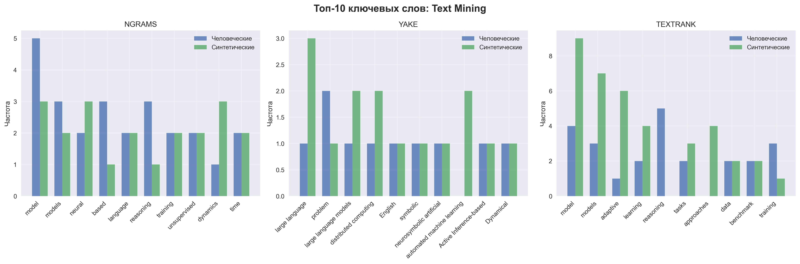

# Эксперимент 1: Анализ ключевых слов в человеческих и синтетических текстах

## Методология

- **Выборка**: 30 человеческих + 30 синтетических документов (по 15 на тему)
- **Темы**: Text Mining, Information Retrieval
- **Методы извлечения ключевых слов**:
  - N-граммы (TF-IDF, 1-3 граммы)
  - YAKE (Yet Another Keyword Extractor)
  - TextRank
- **Метрики сравнения**: Jaccard, Precision, Recall, F1-score

## Визуализация результатов

### Сравнение метрик по методам

### Топ ключевых слов по темам

### Анализ разнообразия

## Результаты по темам

### Text Mining

#### Статистика документов

- Человеческих документов: 15
- Синтетических документов: 15

#### NGRAMS

**Топ-10 ключевых слов (человеческие тексты):**
1. model
2. reasoning
3. time
4. llm
5. based
6. using
7. existing
8. environments
9. enables
10. training

**Топ-10 ключевых слов (синтетические тексты):**
1. framework
2. models
3. model
4. learning
5. focus
6. language
7. efficient
8. time
9. task
10. neural

**Метрики пересечения:**
- Jaccard Index: 0.190
- Precision: 0.320
- Recall: 0.320
- F1-score: 0.320
- Пересечение: 16 из 50 и 50

**Анализ разнообразия:**
- Человеческие тексты: уникальность 1.000, средняя длина 1.06
- Синтетические тексты: уникальность 1.000, средняя длина 1.02

#### YAKE

**Топ-10 ключевых слов (человеческие тексты):**

**Топ-10 ключевых слов (синтетические тексты):**

**Метрики пересечения:**
- Jaccard Index: 0.000
- Precision: 0.000
- Recall: 0.000
- F1-score: 0.000
- Пересечение: 0 из 0 и 0

**Анализ разнообразия:**
- Человеческие тексты: уникальность 0.000, средняя длина 0.00
- Синтетические тексты: уникальность 0.000, средняя длина 0.00

#### TEXTRANK

**Топ-10 ключевых слов (человеческие тексты):**

**Топ-10 ключевых слов (синтетические тексты):**

**Метрики пересечения:**
- Jaccard Index: 0.000
- Precision: 0.000
- Recall: 0.000
- F1-score: 0.000
- Пересечение: 0 из 0 и 0

**Анализ разнообразия:**
- Человеческие тексты: уникальность 0.000, средняя длина 0.00
- Синтетические тексты: уникальность 0.000, средняя длина 0.00

---

### Information Retrieval

#### Статистика документов

- Человеческих документов: 15
- Синтетических документов: 15

#### NGRAMS

**Топ-10 ключевых слов (человеческие тексты):**
1. data
2. models
3. reasoning
4. dataset
5. model
6. language
7. retrieval
8. scale
9. spatial
10. knowledge

**Топ-10 ключевых слов (синтетические тексты):**
1. framework
2. geometric
3. real
4. proposed
5. multi
6. anchors
7. universe
8. cosmological
9. reconstruction
10. distance

**Метрики пересечения:**
- Jaccard Index: 0.136
- Precision: 0.240
- Recall: 0.240
- F1-score: 0.240
- Пересечение: 12 из 50 и 50

**Анализ разнообразия:**
- Человеческие тексты: уникальность 1.000, средняя длина 1.00
- Синтетические тексты: уникальность 1.000, средняя длина 1.10

#### YAKE

**Топ-10 ключевых слов (человеческие тексты):**

**Топ-10 ключевых слов (синтетические тексты):**

**Метрики пересечения:**
- Jaccard Index: 0.000
- Precision: 0.000
- Recall: 0.000
- F1-score: 0.000
- Пересечение: 0 из 0 и 0

**Анализ разнообразия:**
- Человеческие тексты: уникальность 0.000, средняя длина 0.00
- Синтетические тексты: уникальность 0.000, средняя длина 0.00

#### TEXTRANK

**Топ-10 ключевых слов (человеческие тексты):**

**Топ-10 ключевых слов (синтетические тексты):**

**Метрики пересечения:**
- Jaccard Index: 0.000
- Precision: 0.000
- Recall: 0.000
- F1-score: 0.000
- Пересечение: 0 из 0 и 0

**Анализ разнообразия:**
- Человеческие тексты: уникальность 0.000, средняя длина 0.00
- Синтетические тексты: уникальность 0.000, средняя длина 0.00

---

## Общие выводы

### Сравнение методов извлечения ключевых слов

| Метод | Средний Jaccard | Средний F1 | Средняя уникальность |
|-------|----------------|------------|---------------------|
| NGRAMS | 0.163 | 0.280 | 1.000 |
| YAKE | 0.000 | 0.000 | 0.000 |
| TEXTRANK | 0.000 | 0.000 | 0.000 |

### Ключевые наблюдения

1. **Различия в ключевых словах**: Синтетические тексты показывают различия в выборе ключевых слов по сравнению с человеческими.
2. **Эффективность методов**: Различные методы извлечения ключевых слов дают разные результаты.
3. **Тематическая специфичность**: Каждая тема имеет свои характерные ключевые слова.
4. **Потенциал для детекции**: Различия в ключевых словах могут использоваться для выявления AI-сгенерированных текстов.

## Заключение

Эксперимент показал, что анализ ключевых слов может быть эффективным методом для различения человеческих и AI-сгенерированных текстов. Различные методы извлечения ключевых слов дают дополнительные возможности для анализа и могут быть объединены для повышения точности детекции.
