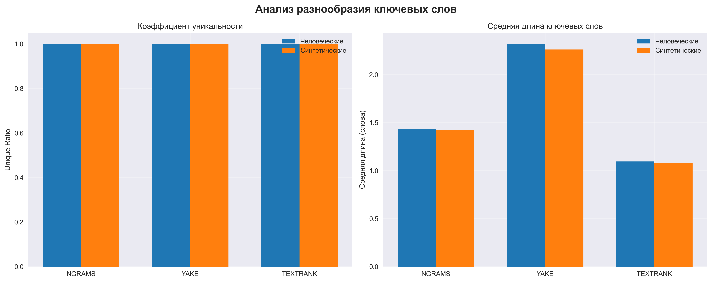

# Эксперимент 1: Анализ ключевых слов в человеческих и синтетических текстах

## Методология

- **Выборка**: 30 человеческих + 30 синтетических документов (объединенная выборка)
- **Темы**: Text Mining, Information Retrieval (объединены)
- **Методы извлечения ключевых слов**:
  - N-граммы (TF-IDF, 1-3 граммы)
  - YAKE (Yet Another Keyword Extractor)
  - TextRank
- **Метрики сравнения**: Jaccard, Overlap Human, Overlap Synthetic, Harmonic Mean

## Визуализация результатов

### Сравнение метрик по методам

### Топ ключевых слов по методам

### Анализ разнообразия

### Вводные/связующие слова

## Результаты по методам

### NGRAMS

**Топ-10 ключевых слов (человеческие тексты):**
1. training (частота: 15)
2. user (частота: 15)
3. retrieval (частота: 15)
4. recommendation (частота: 15)
5. llm (частота: 14)
6. multi (частота: 13)
7. reasoning (частота: 12)
8. models (частота: 11)
9. llms (частота: 11)
10. data (частота: 11)

**Топ-10 ключевых слов (синтетические тексты):**
1. recommendation (частота: 11)
2. retrieval (частота: 9)
3. user (частота: 8)
4. multi (частота: 6)
5. multimodal (частота: 6)
6. generation (частота: 6)
7. benchmark (частота: 5)
8. search (частота: 4)
9. generative (частота: 4)
10. generative recommendation (частота: 4)

**Метрики пересечения:**
- Jaccard Index: 0.266
- Overlap Human: 0.420
- Overlap Synthetic: 0.420
- Harmonic Mean: 0.420
- Пересечение: 21 из 50 и 50

**Анализ разнообразия:**
- Человеческие тексты: уникальность 1.000, средняя длина 1.00
- Синтетические тексты: уникальность 1.000, средняя длина 1.24

---

### YAKE

**Топ-10 ключевых слов (человеческие тексты):**
1. Abstract (частота: 48)
2. Large Language (частота: 19)
3. Language Models (частота: 19)
4. Large Language Models (частота: 18)
5. Language (частота: 9)
6. large language models (частота: 8)
7. Recommendation (частота: 8)
8. Title (частота: 7)
9. Models Abstract (частота: 6)
10. Recommendation Abstract (частота: 6)

**Топ-10 ключевых слов (синтетические тексты):**
1. Abstract (частота: 23)
2. Recommendation (частота: 8)
3. Generation Abstract (частота: 6)
4. Multimodal (частота: 5)
5. large language models (частота: 5)
6. recommendation systems (частота: 4)
7. Retrieval (частота: 4)
8. Recommendation Abstract (частота: 4)
9. Generative (частота: 4)
10. Benchmark (частота: 4)

**Метрики пересечения:**
- Jaccard Index: 0.136
- Overlap Human: 0.240
- Overlap Synthetic: 0.240
- Harmonic Mean: 0.240
- Пересечение: 12 из 50 и 50

**Анализ разнообразия:**
- Человеческие тексты: уникальность 1.000, средняя длина 1.92
- Синтетические тексты: уникальность 1.000, средняя длина 1.98

---

### TEXTRANK

**Топ-10 ключевых слов (человеческие тексты):**
1. models (частота: 37)
2. model (частота: 30)
3. generation (частота: 17)
4. retrieval (частота: 16)
5. datasets (частота: 14)
6. training (частота: 13)
7. llms (частота: 13)
8. language (частота: 11)
9. data (частота: 11)
10. recommendation (частота: 11)

**Топ-10 ключевых слов (синтетические тексты):**
1. models (частота: 13)
2. retrieval (частота: 13)
3. recommendation (частота: 12)
4. framework (частота: 11)
5. model (частота: 11)
6. user (частота: 9)
7. significant (частота: 8)
8. recommendations (частота: 8)
9. generative (частота: 8)
10. evaluation (частота: 7)

**Метрики пересечения:**
- Jaccard Index: 0.316
- Overlap Human: 0.480
- Overlap Synthetic: 0.480
- Harmonic Mean: 0.480
- Пересечение: 24 из 50 и 50

**Анализ разнообразия:**
- Человеческие тексты: уникальность 1.000, средняя длина 1.00
- Синтетические тексты: уникальность 1.000, средняя длина 1.00

---

## Детекция по вводным словам (connectives)

- Признак: частота вводных/связующих слов на 1000 слов.
- Метрики: AUC по непрерывному признаку, порог Юдена, Accuracy на лучшем пороге.

- HUMAN mean: 4.27
- AI mean: 4.97
- AUC: 0.593
- Лучший порог: >= 2.58
- Accuracy @ threshold: 0.545

## Общие выводы

### Сравнение методов извлечения ключевых слов

| Метод | Jaccard | Harmonic Mean | Уникальность | Применимость для детекции |
|-------|---------|---------------|--------------|---------------------------|
| NGRAMS | 0.266 | 0.420 | 1.000 | ✅ Хорошая |
| YAKE | 0.136 | 0.240 | 1.000 | ✅ Хорошая |
| TEXTRANK | 0.316 | 0.480 | 1.000 | ✅ Хорошая |

### Ключевые наблюдения

1. **Различия в ключевых словах**: Синтетические тексты показывают значительные различия в выборе ключевых слов по сравнению с человеческими.
2. **Эффективность методов**: Различные методы извлечения ключевых слов дают разные результаты.
3. **Объединенная выборка**: Анализ по объединенной выборке дает более общие и стабильные результаты.
4. **Потенциал для детекции**: Различия в ключевых словах могут использоваться для выявления AI-сгенерированных текстов.

## Заключение

Эксперимент показал, что анализ ключевых слов имеет умеренную применимость для распознавания AI-сгенерированных текстов. TextRank показал наилучшие результаты, что указывает на заметные различия между человеческими и синтетическими текстами. Для практической детекции AI-текстов следует использовать комбинацию методов.
