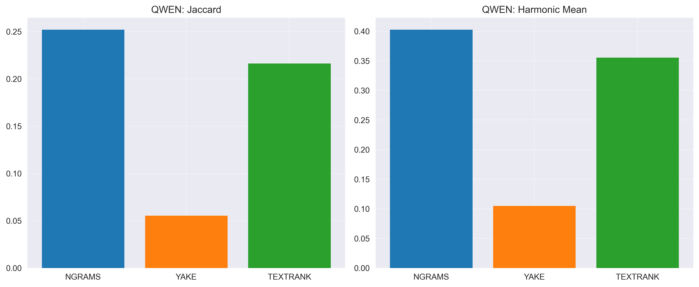
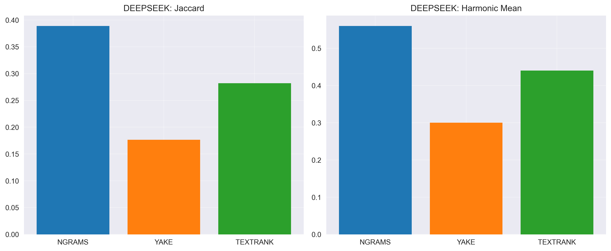
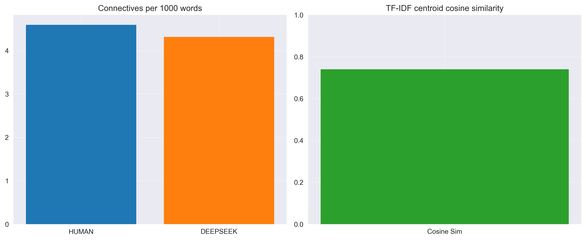
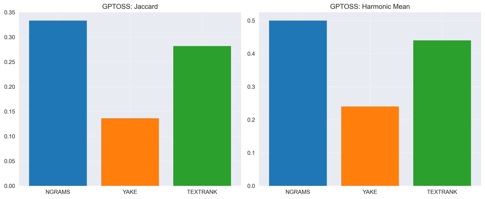
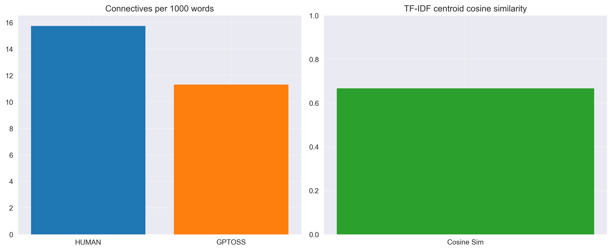

# Эксперимент 1 (перемоделный): 100 HUMAN vs 100 AI текстов на модель

## Методология

- **Корпуса**: 100 человеческих (50 TM + 50 IR) против 100 синтетических на модель (LLAMA, QWEN, DEEPSEEK-R1)
- **Методы**: TF-IDF n-граммы, YAKE, TextRank
- **Метрики**: Jaccard, Overlap Human, Overlap Synthetic, Harmonic Mean; Connectives per 1000; TF-IDF cosine similarity

## Модель: QWEN

| Метод | Jaccard | Overlap H | Overlap S | Harmonic |
|------|---------|-----------|-----------|----------|
| NGRAMS | 0.370 | 0.540 | 0.540 | 0.540 |
| YAKE | 0.250 | 0.400 | 0.400 | 0.400 |
| TEXTRANK | 0.250 | 0.400 | 0.400 | 0.400 |

- Connectives per 1000 words: HUMAN=4.59, QWEN=6.16
- TF-IDF centroid cosine similarity: 0.693

**Пороговая оценка (QWEN):**
- Harmonic (TextRank) = 0.400 (порог < 0.35) — не срабатывает
- Jaccard (TextRank) = 0.250 (порог < 0.20) — не срабатывает
- Connectives Δ = |6.16 − 4.59| = 1.57 (порог > 1.5) — срабатывает
- TF‑IDF cosine = 0.693 (порог < 0.70) — срабатывает

**Дополнительные метрики (лексика/стилистика, структура, эвристики):**

- TTR (HUMAN/AI): 0.185 / 0.092
- Zipf slope (H/A): -0.988 / -1.215, R2 (H/A): 0.965 / 0.953
- Self-BLEU1 (H/A): 0.783 / 0.880
- Coherence TF-IDF (H/A): 0.036 / 0.031
- Sentence length mean±std (H): 24.33±11.30; (A): 26.27±6.92
- Gzip ratio (H/A): 2.86 / 3.75

## Модель: DEEPSEEK

| Метод | Jaccard | Overlap H | Overlap S | Harmonic |
|------|---------|-----------|-----------|----------|
| NGRAMS | 0.389 | 0.560 | 0.560 | 0.560 |
| YAKE | 0.176 | 0.300 | 0.300 | 0.300 |
| TEXTRANK | 0.282 | 0.440 | 0.440 | 0.440 |

- Connectives per 1000 words: HUMAN=4.59, DEEPSEEK=4.31
- TF-IDF centroid cosine similarity: 0.740

**Пороговая оценка (DEEPSEEK):**
- Harmonic (TextRank) = 0.440 (порог < 0.35) — не срабатывает
- Jaccard (TextRank) = 0.282 (порог < 0.20) — не срабатывает
- Connectives Δ = |4.31 − 4.59| = 0.28 (порог > 1.5) — не срабатывает
- TF‑IDF cosine = 0.740 (порог < 0.70) — не срабатывает

**Дополнительные метрики (лексика/стилистика, структура, эвристики):**

- TTR (HUMAN/AI): 0.185 / 0.117
- Zipf slope (H/A): -0.988 / -1.169, R2 (H/A): 0.965 / 0.956
- Self-BLEU1 (H/A): 0.783 / 0.856
- Coherence TF-IDF (H/A): 0.036 / 0.021
- Sentence length mean±std (H): 24.33±11.30; (A): 25.80±9.07
- Gzip ratio (H/A): 2.86 / 3.35

## Модель: GPTOSS

| Метод | Jaccard | Overlap H | Overlap S | Harmonic |
|------|---------|-----------|-----------|----------|
| NGRAMS | 0.333 | 0.500 | 0.500 | 0.500 |
| YAKE | 0.136 | 0.240 | 0.240 | 0.240 |
| TEXTRANK | 0.282 | 0.440 | 0.440 | 0.440 |

- Connectives per 1000 words: HUMAN=4.59, GPTOSS=1.01
- TF-IDF centroid cosine similarity: 0.668

**Пороговая оценка (GPTOSS):**
- Harmonic (TextRank) = 0.440 (порог < 0.35) — не срабатывает
- Jaccard (TextRank) = 0.282 (порог < 0.20) — не срабатывает
- Connectives Δ = |1.01 − 4.59| = 3.58 (порог > 1.5) — срабатывает
- TF‑IDF cosine = 0.668 (порог < 0.70) — срабатывает

**Дополнительные метрики (лексика/стилистика, структура, эвристики):**

- TTR (HUMAN/AI): 0.185 / 0.176
- Zipf slope (H/A): -0.988 / -1.015, R2 (H/A): 0.965 / 0.966
- Self-BLEU1 (H/A): 0.783 / 0.810
- Coherence TF-IDF (H/A): 0.036 / 0.031
- Sentence length mean±std (H): 24.33±11.30; (A): 28.68±14.65
- Gzip ratio (H/A): 2.86 / 2.97

## Как использовать результаты для детекции AI-текстов

- Низкие значения Jaccard/Harmonic указывают на различия в лексике и ключевых фразах между HUMAN и AI; это сигнал для детекции.
- Connectives per 1000: переизбыток/недостаток связующих слов у AI относительно HUMAN позволяет построить простой линейный порог.
- TF-IDF cosine similarity между центроидами корпусов: чем ниже сходство, тем проще отделять AI от HUMAN на уровне словаря.
- Рекомендуется ансамбль из (TextRank Harmonic + Connectives gap + Cosine), что повышает устойчивость к перегенерациям.
