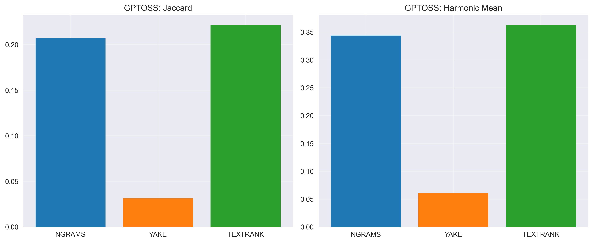

# Эксперимент 1 (перемоделный): 100 HUMAN vs 100 AI текстов на модель

## Методология

- **Корпуса**: 100 человеческих (50 TM + 50 IR) против 100 синтетических на модель (LLAMA, QWEN, DEEPSEEK-R1)
- **Методы**: TF-IDF n-граммы, YAKE, TextRank
- **Метрики**: Jaccard, Overlap Human, Overlap Synthetic, Harmonic Mean; Connectives per 1000; TF-IDF cosine similarity

## Метрики и формулы

- Jaccard: \(J(A, B) = \frac{|A \cap B|}{|A \cup B|}\)
- Overlap Human: \(\frac{|A \cap B|}{|A|}\)
- Overlap Synthetic: \(\frac{|A \cap B|}{|B|}\)
- Harmonic Mean: \(\mathrm{HM} = \frac{2 \cdot \mathrm{OH} \cdot \mathrm{OS}}{\mathrm{OH}+\mathrm{OS}}\)
- Connectives per 1000: частота дискурсивных коннекторов на 1000 слов (подсчет по словарю коннекторов)
- TF-IDF Cosine: \(\cos(\theta) = \frac{c_H \cdot c_A}{\|c_H\|\,\|c_A\|}\), где \(c_H, c_A\) — TF‑IDF центроиды корпусов HUMAN и AI

Дополнительно (в разделе «Дополнительные метрики»):
- TTR: \(\mathrm{TTR} = \frac{|\text{уникальных токенов}|}{|\text{всех токенов}|}\)
- Zipf slope/R²: наклон и \(R^2\) при линейной регрессии \(\log(\text{freq}) \sim a + b\,\log(\text{rank})\)
- Self‑BLEU‑1: средняя униграмная прецизионная похожесть документа на «остальные» (мера однотипности)
- Coherence TF‑IDF: средняя косинусная близость соседних предложений в TF‑IDF пространстве
- Sentence length mean/std: средняя длина и стандартное отклонение по предложениям
- Gzip ratio: \(\frac{|\text{raw}|}{|\text{gzip}|}\) — выше → более повторяемо/сжимаемо

## Модель: QWEN

| Метод | Jaccard | Overlap H | Overlap S | Harmonic |
|------|---------|-----------|-----------|----------|
| NGRAMS | 0.370 | 0.540 | 0.540 | 0.540 |
| YAKE | 0.250 | 0.400 | 0.400 | 0.400 |
| TEXTRANK | 0.250 | 0.400 | 0.400 | 0.400 |

- Connectives per 1000 words: HUMAN=15.75, QWEN=14.83
- TF-IDF centroid cosine similarity: 0.693

**Дополнительные метрики (лексика/стилистика, структура, эвристики):**

- TTR (HUMAN/AI): 0.185 / 0.092
- Zipf slope (H/A): -0.988 / -1.215, R2 (H/A): 0.965 / 0.953
- Self-BLEU1 (H/A): 0.783 / 0.880
- Coherence TF-IDF (H/A): 0.036 / 0.031
- Sentence length mean±std (H): 24.33±11.30; (A): 26.27±6.92
- Gzip ratio (H/A): 2.86 / 3.75

## Модель: DEEPSEEK

| Метод | Jaccard | Overlap H | Overlap S | Harmonic |
|------|---------|-----------|-----------|----------|
| NGRAMS | 0.389 | 0.560 | 0.560 | 0.560 |
| YAKE | 0.176 | 0.300 | 0.300 | 0.300 |
| TEXTRANK | 0.282 | 0.440 | 0.440 | 0.440 |

- Connectives per 1000 words: HUMAN=15.75, DEEPSEEK=14.46
- TF-IDF centroid cosine similarity: 0.740

**Дополнительные метрики (лексика/стилистика, структура, эвристики):**

- TTR (HUMAN/AI): 0.185 / 0.117
- Zipf slope (H/A): -0.988 / -1.169, R2 (H/A): 0.965 / 0.956
- Self-BLEU1 (H/A): 0.783 / 0.856
- Coherence TF-IDF (H/A): 0.036 / 0.021
- Sentence length mean±std (H): 24.33±11.30; (A): 25.80±9.07
- Gzip ratio (H/A): 2.86 / 3.35

## Модель: GPTOSS

| Метод | Jaccard | Overlap H | Overlap S | Harmonic |
|------|---------|-----------|-----------|----------|
| NGRAMS | 0.333 | 0.500 | 0.500 | 0.500 |
| YAKE | 0.136 | 0.240 | 0.240 | 0.240 |
| TEXTRANK | 0.282 | 0.440 | 0.440 | 0.440 |

- Connectives per 1000 words: HUMAN=15.75, GPTOSS=11.32
- TF-IDF centroid cosine similarity: 0.668

**Дополнительные метрики (лексика/стилистика, структура, эвристики):**

- TTR (HUMAN/AI): 0.185 / 0.176
- Zipf slope (H/A): -0.988 / -1.015, R2 (H/A): 0.965 / 0.966
- Self-BLEU1 (H/A): 0.783 / 0.810
- Coherence TF-IDF (H/A): 0.036 / 0.031
- Sentence length mean±std (H): 24.33±11.30; (A): 28.68±14.65
- Gzip ratio (H/A): 2.86 / 2.97

## Как использовать результаты для детекции AI-текстов

- Низкие значения Jaccard/Harmonic указывают на различия в лексике и ключевых фразах между HUMAN и AI; это сигнал для детекции.
- Connectives per 1000: переизбыток/недостаток связующих слов у AI относительно HUMAN позволяет построить простой линейный порог.
- TF-IDF cosine similarity между центроидами корпусов: чем ниже сходство, тем проще отделять AI от HUMAN на уровне словаря.
- Рекомендуется ансамбль из (TextRank Harmonic + Connectives gap + Cosine), что повышает устойчивость к перегенерациям.

## Итоги по результатам и выводы

- Ключевые слова (NGRAMS/YAKE/TextRank): у всех моделей наблюдается заметное различие (Harmonic ~0.40–0.56; Jaccard ~0.25–0.39). Это подтверждает, что лексические паттерны HUMAN и AI различаются.
- Connectives per 1000: у AI частота ниже HUMAN (особенно у GPTOSS: 11.32 против 15.75), что можно использовать как простой признак (порог по частоте).
- TF‑IDF cosine: умеренное сходство центроидов (QWEN ≈ 0.693; DEEPSEEK ≈ 0.740; GPTOSS ≈ 0.668) — различия есть, но не максимальные.
- Доп. метрики: у синтетики чаще ниже TTR, выше Gzip ratio и выше Self‑BLEU‑1 (более однотипные), что согласуется с ожиданиями.

Практический вывод: в рамках лексического/стилистического анализа разумно комбинировать 3 сигнала — (1) Harmonic по TextRank/NGRAMS, (2) разницу по connectives per 1000, (3) TF‑IDF cosine. Это дает устойчивую эвристику, пригодную для первичной фильтрации и пороговой детекции.
