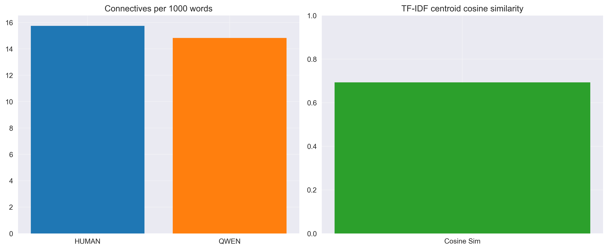
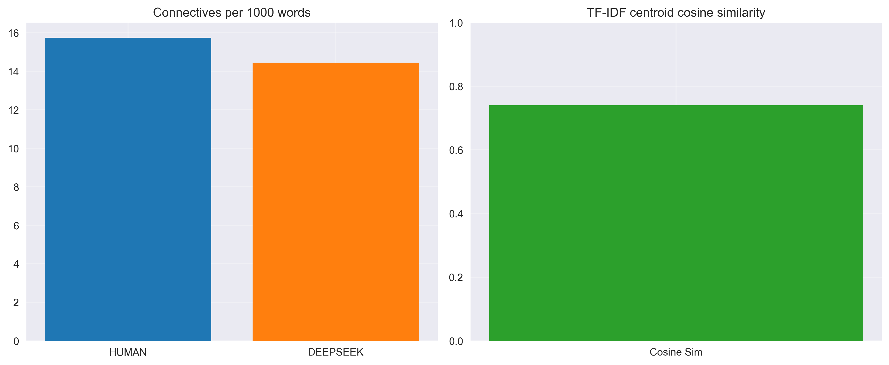

# Эксперимент 1 (перемоделный): 100 HUMAN vs 100 AI текстов на модель

## Методология

- **Корпуса**: 100 человеческих (50 TM + 50 IR) против 100 синтетических на модель (LLAMA, QWEN, DEEPSEEK-R1)
- **Методы**: TF-IDF n-граммы, YAKE, TextRank
- **Метрики**: Jaccard, Overlap Human, Overlap Synthetic, Harmonic Mean; Connectives per 1000; TF-IDF cosine similarity

## Модель: QWEN

| Метод | Jaccard | Overlap H | Overlap S | Harmonic |
|------|---------|-----------|-----------|----------|
| NGRAMS | 0.370 | 0.540 | 0.540 | 0.540 |
| YAKE | 0.250 | 0.400 | 0.400 | 0.400 |
| TEXTRANK | 0.250 | 0.400 | 0.400 | 0.400 |

- Connectives per 1000 words: HUMAN=4.59, QWEN=6.16
- TF-IDF centroid cosine similarity: 0.693

**Пороговая оценка (QWEN):**
- Harmonic (TextRank) = 0.400 (порог < 0.35) — не срабатывает
- Jaccard (TextRank) = 0.250 (порог < 0.20) — не срабатывает
- Connectives Δ = |6.16 − 4.59| = 1.57 (порог > 1.5) — срабатывает
- TF‑IDF cosine = 0.693 (порог < 0.70) — срабатывает

**Дополнительные метрики (лексика/стилистика, структура, эвристики):**

- TTR (HUMAN/AI): 0.185 / 0.092
- Zipf slope (H/A): -0.988 / -1.215, R2 (H/A): 0.965 / 0.953
- Self-BLEU1 (H/A): 0.783 / 0.880
- Coherence TF-IDF (H/A): 0.036 / 0.031
- Sentence length mean±std (H): 24.33±11.30; (A): 26.27±6.92
- Gzip ratio (H/A): 2.86 / 3.75

## Модель: DEEPSEEK

| Метод | Jaccard | Overlap H | Overlap S | Harmonic |
|------|---------|-----------|-----------|----------|
| NGRAMS | 0.389 | 0.560 | 0.560 | 0.560 |
| YAKE | 0.176 | 0.300 | 0.300 | 0.300 |
| TEXTRANK | 0.282 | 0.440 | 0.440 | 0.440 |

- Connectives per 1000 words: HUMAN=4.59, DEEPSEEK=4.31
- TF-IDF centroid cosine similarity: 0.740

**Пороговая оценка (DEEPSEEK):**
- Harmonic (TextRank) = 0.440 (порог < 0.35) — не срабатывает
- Jaccard (TextRank) = 0.282 (порог < 0.20) — не срабатывает
- Connectives Δ = |4.31 − 4.59| = 0.28 (порог > 1.5) — не срабатывает
- TF‑IDF cosine = 0.740 (порог < 0.70) — не срабатывает

**Дополнительные метрики (лексика/стилистика, структура, эвристики):**

- TTR (HUMAN/AI): 0.185 / 0.117
- Zipf slope (H/A): -0.988 / -1.169, R2 (H/A): 0.965 / 0.956
- Self-BLEU1 (H/A): 0.783 / 0.856
- Coherence TF-IDF (H/A): 0.036 / 0.021
- Sentence length mean±std (H): 24.33±11.30; (A): 25.80±9.07
- Gzip ratio (H/A): 2.86 / 3.35

## Модель: GPTOSS

| Метод | Jaccard | Overlap H | Overlap S | Harmonic |
|------|---------|-----------|-----------|----------|
| NGRAMS | 0.333 | 0.500 | 0.500 | 0.500 |
| YAKE | 0.136 | 0.240 | 0.240 | 0.240 |
| TEXTRANK | 0.282 | 0.440 | 0.440 | 0.440 |

- Connectives per 1000 words: HUMAN=4.59, GPTOSS=1.01
- TF-IDF centroid cosine similarity: 0.668

**Пороговая оценка (GPTOSS):**
- Harmonic (TextRank) = 0.440 (порог < 0.35) — не срабатывает
- Jaccard (TextRank) = 0.282 (порог < 0.20) — не срабатывает
- Connectives Δ = |1.01 − 4.59| = 3.58 (порог > 1.5) — срабатывает
- TF‑IDF cosine = 0.668 (порог < 0.70) — срабатывает

**Дополнительные метрики (лексика/стилистика, структура, эвристики):**

- TTR (HUMAN/AI): 0.185 / 0.176
- Zipf slope (H/A): -0.988 / -1.015, R2 (H/A): 0.965 / 0.966
- Self-BLEU1 (H/A): 0.783 / 0.810
- Coherence TF-IDF (H/A): 0.036 / 0.031
- Sentence length mean±std (H): 24.33±11.30; (A): 28.68±14.65
- Gzip ratio (H/A): 2.86 / 2.97

## Как использовать результаты для детекции AI-текстов

- Низкие значения Jaccard/Harmonic указывают на различия в лексике и ключевых фразах между HUMAN и AI; это сигнал для детекции.
- Connectives per 1000: переизбыток/недостаток связующих слов у AI относительно HUMAN позволяет построить простой линейный порог.
- TF-IDF cosine similarity между центроидами корпусов: чем ниже сходство, тем проще отделять AI от HUMAN на уровне словаря.
- Рекомендуется ансамбль из (TextRank Harmonic + Connectives gap + Cosine), что повышает устойчивость к перегенерациям.

## Подробное описание метрик

### Jaccard (лексическое пересечение)
- Что измеряет: общая похожесть множеств ключевых слов HUMAN и AI.
- Формула: `J(A, B) = |A ∩ B| / |A ∪ B|`.
- Диапазон/интерпретация: [0;1]; ближе к 1 — списки ключей совпадают.
- Чувствительность/ограничения: нестабилен при малых множествах; не учитывает синонимы/семантику.

### Overlap Human / Overlap Synthetic (асимметричные доли)
- Что измеряют: какую долю ключей одной стороны покрывает другая — OH = `|A ∩ B| / |A|`, OS = `|A ∩ B| / |B|`.
- Интерпретация: «насколько AI воспроизводит человеческие ключи» и наоборот.
- Ограничения: при значительной разнице размеров множеств требуется учитывать вместе с Jaccard/Harmonic.

### Harmonic Mean (сбалансированная сводка)
- Что измеряет: согласованность OH и OS; растёт, если растут обе доли.
- Формула: `HM = 2 × (OH × OS) / (OH + OS)` (если `OH + OS > 0`).
- Интерпретация: удобная итоговая метрика, когда важен баланс пересечения.

### Connectives per 1000 (вводные/связки)
- Что измеряет: плотность риторических связок (however, therefore, thus, moreover, in addition, on the other hand и др.)
- Расчёт: `#вхождений / #слов × 1000`.
- Интерпретация: сдвиг относительно HUMAN — индикатор «шаблонности» или «отполированности» AI‑текста.
- Замечания: нормализовать по жанрам/темам; расширять словарь связок при необходимости.

### TF‑IDF centroid cosine similarity (сходство словарей)
- Что измеряет: косинусная близость центроидов HUMAN и AI в TF‑IDF пространстве.
- Интерпретация: ближе к 1 — словари близки; ближе к 0 — различаются.
- Ограничения: лексическая метрика; не ловит глубокую семантику.

### TTR — Type‑Token Ratio (лексическое разнообразие)
- Что измеряет: долю уникальной лексики в общем числе токенов.
- Формула: `|V|/N`.
- Интерпретация: ниже у AI — признак однотипности; но зависим от длины, сравнивать в агрегате.

### Zipf slope / R² (естественность частотного профиля)
- Что измеряет: наклон лог‑частоты по лог‑рангу (`log(freq) ~ a + b·log(rank)`) и качество аппроксимации.
- Интерпретация: отклонение наклона/пониженный R² — сигнал неестественной лексики.

### Self‑BLEU‑1 (однотипность)
- Что измеряет: «насколько документы похожи друг на друга» по униграммам; высокая величина — шаблонность.
- Расчёт: средняя униграммная точность каждого документа относительно объединённых референсов других.

### Coherence TF‑IDF (локальная когерентность)
- Что измеряет: среднюю косинусную близость TF‑IDF векторов соседних предложений.
- Интерпретация: слишком ровно/слишком низко — признак шаблонной структуры.

### Burstiness (средняя длина ± std предложений)
- Что измеряет: вариативность длины предложений; у HUMAN чаще выше.
- Интерпретация: низкая дисперсия — косвенный признак AI.

### Gzip ratio (компрессируемость)
- Что измеряет: регулярность/повторяемость лексики на уровне корпуса.
- Интерпретация: более «сжимаемые» тексты — более регулярные; отклонения от HUMAN — признак AI.
