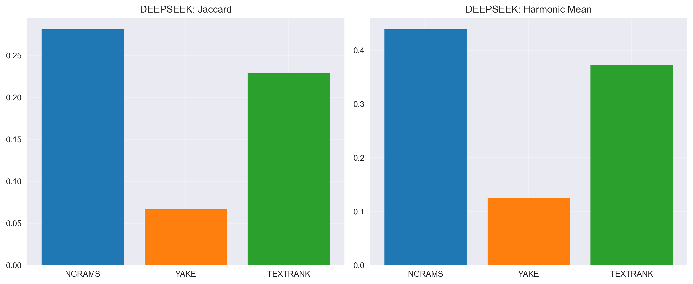

# Эксперимент 1 (перемоделный): 100 HUMAN vs 100 AI текстов на модель

## Методология

- **Корпуса**: 100 человеческих (50 TM + 50 IR) против 100 синтетических на модель (LLAMA, QWEN, DEEPSEEK-R1)
- **Методы**: TF-IDF n-граммы, YAKE, TextRank
- **Метрики**: Jaccard, Overlap Human, Overlap Synthetic, Harmonic Mean; Connectives per 1000; TF-IDF cosine similarity

## Метрики и формулы

- Jaccard: J(A,B) = |A∩B| / |A∪B|
- Overlap Human: |A∩B| / |A|; Overlap Synthetic: |A∩B| / |B|
- Harmonic Mean: 2·OH·OS / (OH+OS)
- Connectives per 1000: частота коннекторов на 1000 слов по словарю коннекторов
- TF-IDF Cosine: cos(θ) = (c_H·c_A) / (||c_H||·||c_A||), где c_H,c_A — TF‑IDF центроиды HUMAN/AI

Пример: при топ-50 слов у HUMAN/AI и пересечении = 20 получим J=0.25, Overlap=0.40/0.40, Harmonic=0.40 — это умеренное пересечение, не сильная схожесть.

## Модель: QWEN

| Метод | Jaccard | Overlap H | Overlap S | Harmonic |
|------|---------|-----------|-----------|----------|
| NGRAMS | 0.252 | 0.366 | 0.448 | 0.403 |
| YAKE | 0.055 | 0.101 | 0.109 | 0.105 |
| TEXTRANK | 0.216 | 0.398 | 0.321 | 0.356 |

- Connectives per 1000 words: HUMAN=15.75, QWEN=14.83
- Connectives detection: AUC=0.503, Threshold <= 7.71, Acc@thr=0.420
- TF-IDF centroid cosine similarity: 0.693

**Дополнительные метрики (лексика/стилистика, структура, эвристики):**

- TTR (HUMAN/AI): 0.185 / 0.092
- Zipf slope (H/A): -0.988 / -1.215, R2 (H/A): 0.965 / 0.953
- Self-BLEU1 (H/A): 0.783 / 0.880
- Coherence TF-IDF (H/A): 0.036 / 0.031
- Sentence length mean±std (H): 24.33±11.30; (A): 26.27±6.92
- Gzip ratio (H/A): 2.86 / 3.75

## Модель: DEEPSEEK

| Метод | Jaccard | Overlap H | Overlap S | Harmonic |
|------|---------|-----------|-----------|----------|
| NGRAMS | 0.281 | 0.396 | 0.492 | 0.439 |
| YAKE | 0.066 | 0.117 | 0.133 | 0.125 |
| TEXTRANK | 0.229 | 0.474 | 0.306 | 0.372 |

- Connectives per 1000 words: HUMAN=15.75, DEEPSEEK=14.46
- Connectives detection: AUC=0.491, Threshold <= 8.50, Acc@thr=0.395
- TF-IDF centroid cosine similarity: 0.740

**Дополнительные метрики (лексика/стилистика, структура, эвристики):**

- TTR (HUMAN/AI): 0.185 / 0.117
- Zipf slope (H/A): -0.988 / -1.169, R2 (H/A): 0.965 / 0.956
- Self-BLEU1 (H/A): 0.783 / 0.856
- Coherence TF-IDF (H/A): 0.036 / 0.021
- Sentence length mean±std (H): 24.33±11.30; (A): 25.80±9.07
- Gzip ratio (H/A): 2.86 / 3.35

## Модель: GPTOSS

| Метод | Jaccard | Overlap H | Overlap S | Harmonic |
|------|---------|-----------|-----------|----------|
| NGRAMS | 0.208 | 0.336 | 0.352 | 0.344 |
| YAKE | 0.031 | 0.061 | 0.061 | 0.061 |
| TEXTRANK | 0.221 | 0.374 | 0.352 | 0.363 |

- Connectives per 1000 words: HUMAN=15.75, GPTOSS=11.32
- Connectives detection: AUC=0.387, Threshold <= inf, Acc@thr=0.500
- TF-IDF centroid cosine similarity: 0.668

**Дополнительные метрики (лексика/стилистика, структура, эвристики):**

- TTR (HUMAN/AI): 0.185 / 0.176
- Zipf slope (H/A): -0.988 / -1.015, R2 (H/A): 0.965 / 0.966
- Self-BLEU1 (H/A): 0.783 / 0.810
- Coherence TF-IDF (H/A): 0.036 / 0.031
- Sentence length mean±std (H): 24.33±11.30; (A): 28.68±14.65
- Gzip ratio (H/A): 2.86 / 2.97

## Как использовать результаты для детекции AI-текстов

- Jaccard/Harmonic ~ 0.25–0.56 указывают лишь на умеренную разницу в наборах ключевых слов — этих сигналов недостаточно для надежной детекции в одиночку.
- Connectives per 1000 даёт небольшой сдвиг (у AI часто ниже). Можно ставить простой порог, но точность ограничена.
- TF‑IDF cosine (≈0.67–0.74) отражает умеренную разделимость словарей и подходит как вспомогательная фича.
- Практический подход: объединять признаки в скоринг (например, Score = α·(1−Harmonic) + β·|ΔConnectives| + γ·(1−Cosine)) и валидировать порог на отложенной выборке. Основной детектор — семантический (см. Эксперимент 2).

## Итоги по результатам и выводы

- Лексические/стилистические метрики дают слабые–умеренные сигналы различий; использовать их стоит как часть ансамбля.
- Для практической детекции рекомендуется совмещать Jaccard/Harmonic, Connectives per 1000 и TF‑IDF cosine; улучшение ожидаемо при добавлении семантических фич.
