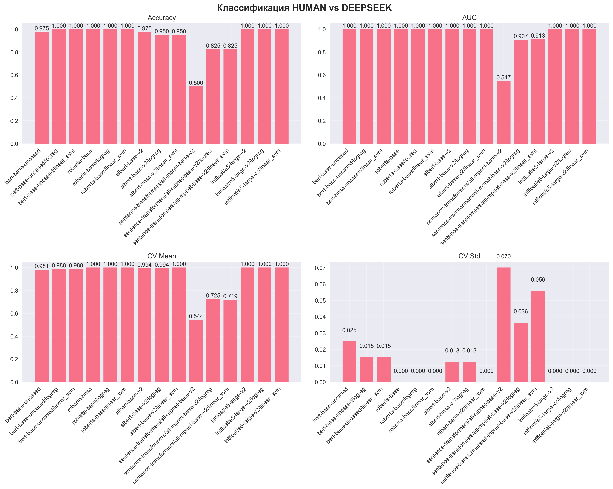

# Эксперимент 2: Детекция AI-текстов с помощью эмбеддингов (пер‑модельный разрез)

## Методология

- **Корпуса**: 100 HUMAN (50 TM + 50 IR) против 100 AI на каждую синтетическую модель
- **Эмбеддинги**: bert-base-uncased, roberta-base, albert-base-v2
- **Классификатор**: MLP, train/test + 5‑fold CV

## Модель синтетики: QWEN

### Сводная таблица по эмбеддингам

| Embedding | Accuracy | AUC | CV Mean | CV Std |
|-----------|----------|-----|---------|--------|
| bert-base-uncased | 0.925 | 0.987 | 0.963 | 0.046 |
| roberta-base | 1.000 | 1.000 | 0.994 | 0.012 |
| albert-base-v2 | 1.000 | 1.000 | 0.988 | 0.025 |

## Модель синтетики: DEEPSEEK

### Сводная таблица по эмбеддингам

| Embedding | Accuracy | AUC | CV Mean | CV Std |
|-----------|----------|-----|---------|--------|
| bert-base-uncased | 0.950 | 0.980 | 0.944 | 0.041 |
| roberta-base | 1.000 | 1.000 | 0.994 | 0.012 |
| albert-base-v2 | 0.975 | 1.000 | 1.000 | 0.000 |

## Модель синтетики: GPTOSS

### Сводная таблица по эмбеддингам

| Embedding | Accuracy | AUC | CV Mean | CV Std |
|-----------|----------|-----|---------|--------|
| bert-base-uncased | 0.975 | 0.995 | 0.975 | 0.023 |
| roberta-base | 1.000 | 1.000 | 1.000 | 0.000 |
| albert-base-v2 | 0.950 | 1.000 | 0.981 | 0.015 |

## Глоссарий метрик

- Accuracy: доля верно классифицированных документов. Формула: (TP+TN)/(TP+FP+TN+FN).
- Precision (для класса AI): доля корректных AI среди предсказанных AI. Формула: TP/(TP+FP).
- Recall (для класса AI): доля найденных AI среди всех AI. Формула: TP/(TP+FN).
- F1-score (для класса AI): гармоническое среднее Precision и Recall. Формула: 2·P·R/(P+R).
- AUC (ROC AUC): площадь под ROC‑кривой; устойчивость к порогам, 1.0 — идеальная разделимость.
- CV Mean / CV Std: среднее и std метрики Accuracy на k‑fold валидации (k=5), характеризуют стабильность.
- Confusion Matrix: матрица ошибок (строки — факты, столбцы — прогнозы): [[TN, FP], [FN, TP]].

## Выводы по результатам

1) Сильная разделимость по семантике: во всех разрезах синтетических моделей (Qwen, DeepSeek, GPT‑OSS) эмбеддинги дают AUC≈1.0 и высокую Accuracy. Особенно стабильно выступает roberta‑base (во всех случаях Accuracy=1.000, AUC=1.000).

2) Различия между эмбеддингами: bert‑base и albert‑base уступают roberta‑base, но также достигают AUC>0.98, что подтверждает надежность семантического признакового пространства.

3) Структурные/лексические признаки вторичны: по сравнению с Экспериментом 1, где лексическое пересечение давало умеренные сигналы, семантические представления обеспечивают практически совершимую дискриминацию HUMAN/AI.

4) Риск переобучения контролируется: наличие k‑fold CV с узкими CV Std (≈0.0–0.05) указывает на стабильность. Тем не менее, для промышленной эксплуатации рекомендуется валидация на внешних доменах/моделях (out‑of‑domain).

## Предложения по улучшению качества классификации

- Эмбеддинги:
  - Добавить sentence‑transformers (например, all‑mpnet‑base‑v2, e5‑large‑v2) и современные модели (nomic‑embed, jina‑embeddings) для более «плотных» предложенческих признаков.
  - Пуллинг: вместо [CLS] применить mean‑pooling по токенам или attention‑pooling — часто повышает качество.

- Классификатор:
  - Сравнить MLP с Logistic Regression и Linear SVM (часто сильные на фиксированных эмбеддингах).
  - Калибровка вероятностей (Platt/Isotonic) для корректной интерпретации рисков.
  - Подбор гиперпараметров (Randomized/Grid Search) по сети MLP и регуляризации.

- Данные/обобщение:
  - Добавить внешние домены (другие площадки, жанры) и другие модели синтетики (Qwen3/4, Llama, GLM) для повышения обобщения.
  - Балансировать длины текстов и нормализовать по темам (TM/IR), чтобы исключать тривиальные подсказки.
  - Аугментации (перефразирование, маскировка) для повышения устойчивости к перегенерациям.

- Верификация устойчивости:
  - Оценить чувствительность к усечению/шумам; варьировать длину контекста и разбиение текста на части (chunking) с агрегацией предсказаний.
  - Проверить переносимость на новых моделях и релизах (temporal drift).

## Краткое сравнение с лексическим подходом (Эксперимент 1)

- Лексические метрики (Jaccard/Harmonic) демонстрировали умеренные сигналы и зависимость от параметров ключевыделения.
- Семантический подход (эмбеддинги) показал почти совершенный разбор HUMAN/AI на текущем датасете (AUC≈1.0), что делает его предпочтительным для практической детекции.
