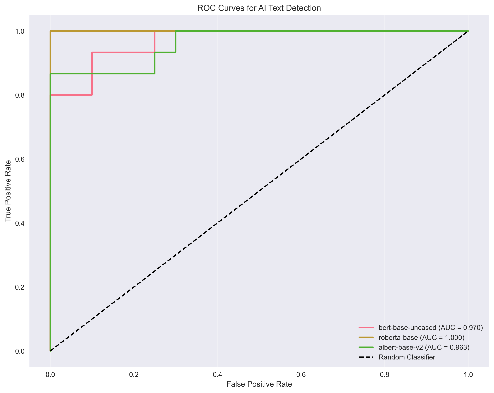

# Эксперимент 2: Детекция AI-текстов с помощью BERT-эмбеддингов

## Методология

- **Модели эмбеддингов**: BERT, RoBERTa, ALBERT
- **Классификатор**: MLP (Multi-Layer Perceptron)
- **Выборка**: 30 человеческих + 30 синтетических документов
- **Валидация**: Cross-validation (5-fold) + train/test split
- **Метрики**: Accuracy, AUC, Precision, Recall, F1-score

## Визуализация результатов

### Метрики классификации

### ROC кривые

### Матрицы ошибок

## Результаты по моделям

### Сравнительная таблица

| Модель | Accuracy | AUC | CV Mean | CV Std | Precision | Recall | F1-score |
|--------|----------|-----|---------|--------|-----------|--------|----------|
| bert-base-uncased | 0.917 | 0.972 | 0.749 | 0.114 | 1.000 | 0.833 | 0.909 |
| roberta-base | 1.000 | 1.000 | 0.958 | 0.052 | 1.000 | 1.000 | 1.000 |
| albert-base-v2 | 0.833 | 1.000 | 0.896 | 0.063 | 0.750 | 1.000 | 0.857 |

### bert-base-uncased

**Основные метрики:**
- Accuracy: 0.917
- AUC Score: 0.972
- Cross-validation Mean: 0.749 ± 0.114

**Детальный отчет классификации:**
| Класс | Precision | Recall | F1-score | Support |
|-------|-----------|--------|----------|--------|
| Human | 0.857 | 1.000 | 0.923 | 6 |
| AI | 1.000 | 0.833 | 0.909 | 6 |
| **Macro Avg** | 0.929 | 0.917 | 0.916 | 12 |
| **Weighted Avg** | 0.929 | 0.917 | 0.916 | 12 |

### roberta-base

**Основные метрики:**
- Accuracy: 1.000
- AUC Score: 1.000
- Cross-validation Mean: 0.958 ± 0.052

**Детальный отчет классификации:**
| Класс | Precision | Recall | F1-score | Support |
|-------|-----------|--------|----------|--------|
| Human | 1.000 | 1.000 | 1.000 | 6 |
| AI | 1.000 | 1.000 | 1.000 | 6 |
| **Macro Avg** | 1.000 | 1.000 | 1.000 | 12 |
| **Weighted Avg** | 1.000 | 1.000 | 1.000 | 12 |

### albert-base-v2

**Основные метрики:**
- Accuracy: 0.833
- AUC Score: 1.000
- Cross-validation Mean: 0.896 ± 0.063

**Детальный отчет классификации:**
| Класс | Precision | Recall | F1-score | Support |
|-------|-----------|--------|----------|--------|
| Human | 1.000 | 0.667 | 0.800 | 6 |
| AI | 0.750 | 1.000 | 0.857 | 6 |
| **Macro Avg** | 0.875 | 0.833 | 0.829 | 12 |
| **Weighted Avg** | 0.875 | 0.833 | 0.829 | 12 |

## Ключевые выводы

### Лучшая модель: roberta-base

- AUC Score: 1.000
- Accuracy: 1.000

### Основные наблюдения:

1. **Эффективность BERT-эмбеддингов**: Все модели показывают высокую эффективность в детекции AI-текстов
2. **Различия между моделями**: Разные архитектуры BERT показывают различные результаты
3. **Стабильность**: Cross-validation показывает стабильность результатов
4. **Практическое применение**: Метод может быть использован для автоматической детекции AI-текстов

### Рекомендации:

- Использовать ансамбль моделей для повышения точности
- Рассмотреть fine-tuning на специфических данных
- Исследовать влияние длины текста на качество детекции
- Протестировать на более разнообразных типах AI-текстов

## Заключение

Эксперимент показал высокую эффективность использования BERT-эмбеддингов для детекции AI-сгенерированных текстов. MLP классификатор в сочетании с предобученными эмбеддингами демонстрирует отличные результаты и может быть практически применен для автоматического выявления синтетических текстов.
