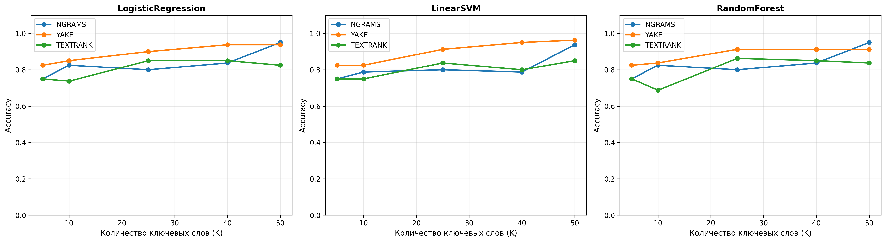
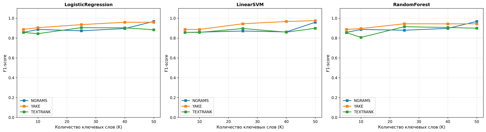
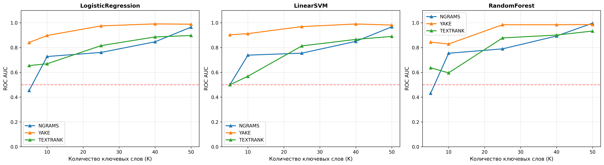
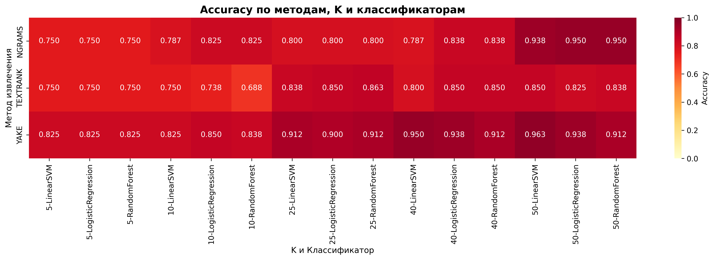

# Эксперимент 4: Классификация HUMAN vs AI на основе ключевых слов

## Методология

- **Цель**: Создание классификатора для детекции синтетических текстов на основе присутствия ключевых слов
- **Методы извлечения ключевых слов**: TF-IDF n-grams, YAKE, TextRank
- **Классификаторы**: Logistic Regression, Linear SVM, Random Forest
- **Количество ключевых слов**: K ∈ {5, 10, 25, 40, 50}
- **Векторы признаков**: Бинарные (присутствие/отсутствие ключевого слова в документе)
- **Разделение данных**: Train/Test = 80/20 с стратификацией
- **Метрики**: Accuracy, Precision, Recall, F1-score, ROC AUC, 5-fold CV

## Принцип работы классификатора на основе ключевых слов

### Алгоритм работы

Классификатор работает в несколько этапов:

#### Этап 1: Извлечение ключевых слов из корпуса

Из всего объединенного корпуса (HUMAN + AI документы) извлекаются топ-K наиболее значимых ключевых слов одним из трех методов:

1. **TF-IDF n-grams** (биграммы и триграммы):
   - Создается TF-IDF матрица для всех документов
   - Выбираются n-граммы (1-2 слова) с максимальной суммарной TF-IDF оценкой
   - Учитывается частота и обратная частота документа

2. **YAKE** (Yet Another Keyword Extractor):
   - Статистический метод без обучения
   - Учитывает позицию слова, частоту, длину и другие факторы
   - Извлекает ключевые фразы с учетом контекста

3. **TextRank**:
   - Графовый алгоритм на основе PageRank
   - Строит граф слов по их совместной встречаемости
   - Выбирает вершины с наибольшим ранком

#### Этап 2: Создание признакового пространства

Для каждого документа создается бинарный вектор признаков размерности K:

```
x[d] = [x₁, x₂, ..., xₖ], где:
  xᵢ = 1, если i-е ключевое слово присутствует в документе d
  xᵢ = 0, если i-е ключевое слово отсутствует в документе d
```

**Особенности:**
- Простая бинарная индикация (присутствие/отсутствие)
- Не учитывается частота или позиция слова
- Размерность фиксирована и равна K
- Разреженное представление (большинство элементов = 0)

#### Этап 3: Обучение классификаторов

На обучающей выборке (80% данных) обучаются три классификатора:

1. **Logistic Regression**:
   - Линейная модель: `P(y=1|x) = σ(wᵀx + b)`
   - Обучается максимизацией log-likelihood
   - Дает вероятностные оценки принадлежности классу

2. **Linear SVM**:
   - Ищет оптимальную разделяющую гиперплоскость
   - Максимизирует зазор между классами
   - Использует ядро для вероятностных оценок

3. **Random Forest**:
   - Ансамбль из 100 решающих деревьев
   - Каждое дерево обучается на подвыборке признаков
   - Финальное предсказание - большинство голосов деревьев

#### Этап 4: Классификация новых документов

Для нового документа:
1. Проверяется наличие каждого из K ключевых слов → создается бинарный вектор
2. Вектор подается в обученный классификатор
3. Получается предсказание класса (HUMAN=0 или AI=1) и вероятность

### Почему это работает?

**Гипотеза**: Синтетические и человеческие тексты имеют различное распределение ключевых слов:
- **HUMAN тексты**: Используют более разнообразный и естественный словарь
- **AI тексты**: Могут иметь характерные паттерны, повторяющиеся фразы или специфические термины

Ключевые слова, извлеченные из корпуса, отражают эти различия и служат индикаторами для классификации.

### Формулы и метрики

### Создание признаков

Для каждого документа создается бинарный вектор размерности K:
- x[i] = 1, если i-е ключевое слово присутствует в документе
- x[i] = 0, если i-е ключевое слово отсутствует в документе

### Метрики классификации

- **Accuracy**: `(TP + TN) / (TP + TN + FP + FN)` - доля правильных классификаций
- **Precision**: `TP / (TP + FP)` - точность предсказания AI-класса
- **Recall**: `TP / (TP + FN)` - полнота обнаружения AI-текстов
- **F1-score**: `2 × (Precision × Recall) / (Precision + Recall)` - гармоническое среднее
- **ROC AUC**: Площадь под ROC-кривой (1.0 = идеальная разделимость, 0.5 = случайный угадывание)
- **CV Mean/Std**: Среднее и стандартное отклонение Accuracy на 5-fold cross-validation (оценка устойчивости)

## Результаты

### Метод: NGRAMS

| K | Классификатор | Accuracy | Precision | Recall | F1 | AUC | CV Mean | CV Std |
|---|---------------|----------|-----------|--------|----|----|---------|--------|
| 5 | LogisticRegression | 0.750 | 0.750 | 1.000 | 0.857 | 0.454 | 0.750 | 0.000 |
| 5 | LinearSVM | 0.750 | 0.750 | 1.000 | 0.857 | 0.500 | 0.750 | 0.000 |
| 5 | RandomForest | 0.750 | 0.750 | 1.000 | 0.857 | 0.431 | 0.741 | 0.021 |
| 10 | LogisticRegression | 0.825 | 0.859 | 0.917 | 0.887 | 0.728 | 0.819 | 0.025 |
| 10 | LinearSVM | 0.787 | 0.852 | 0.867 | 0.860 | 0.739 | 0.784 | 0.046 |
| 10 | RandomForest | 0.825 | 0.859 | 0.917 | 0.887 | 0.754 | 0.803 | 0.025 |
| 25 | LogisticRegression | 0.800 | 0.833 | 0.917 | 0.873 | 0.761 | 0.841 | 0.029 |
| 25 | LinearSVM | 0.800 | 0.844 | 0.900 | 0.871 | 0.755 | 0.844 | 0.033 |
| 25 | RandomForest | 0.800 | 0.806 | 0.967 | 0.879 | 0.790 | 0.803 | 0.019 |
| 40 | LogisticRegression | 0.838 | 0.862 | 0.933 | 0.896 | 0.847 | 0.856 | 0.055 |
| 40 | LinearSVM | 0.787 | 0.841 | 0.883 | 0.862 | 0.850 | 0.850 | 0.058 |
| 40 | RandomForest | 0.838 | 0.851 | 0.950 | 0.898 | 0.893 | 0.866 | 0.025 |
| 50 | LogisticRegression | 0.950 | 0.938 | 1.000 | 0.968 | 0.965 | 0.934 | 0.039 |
| 50 | LinearSVM | 0.938 | 0.937 | 0.983 | 0.959 | 0.968 | 0.944 | 0.012 |
| 50 | RandomForest | 0.950 | 0.938 | 1.000 | 0.968 | 0.997 | 0.947 | 0.035 |

### Метод: YAKE

| K | Классификатор | Accuracy | Precision | Recall | F1 | AUC | CV Mean | CV Std |
|---|---------------|----------|-----------|--------|----|----|---------|--------|
| 5 | LogisticRegression | 0.825 | 0.859 | 0.917 | 0.887 | 0.841 | 0.859 | 0.026 |
| 5 | LinearSVM | 0.825 | 0.859 | 0.917 | 0.887 | 0.903 | 0.859 | 0.026 |
| 5 | RandomForest | 0.825 | 0.859 | 0.917 | 0.887 | 0.844 | 0.850 | 0.027 |
| 10 | LogisticRegression | 0.850 | 0.864 | 0.950 | 0.905 | 0.897 | 0.875 | 0.010 |
| 10 | LinearSVM | 0.825 | 0.859 | 0.917 | 0.887 | 0.912 | 0.853 | 0.016 |
| 10 | RandomForest | 0.838 | 0.862 | 0.933 | 0.896 | 0.829 | 0.847 | 0.030 |
| 25 | LogisticRegression | 0.900 | 0.906 | 0.967 | 0.935 | 0.975 | 0.947 | 0.021 |
| 25 | LinearSVM | 0.912 | 0.908 | 0.983 | 0.944 | 0.969 | 0.938 | 0.024 |
| 25 | RandomForest | 0.912 | 0.908 | 0.983 | 0.944 | 0.984 | 0.938 | 0.010 |
| 40 | LogisticRegression | 0.938 | 0.937 | 0.983 | 0.959 | 0.991 | 0.938 | 0.024 |
| 40 | LinearSVM | 0.950 | 0.952 | 0.983 | 0.967 | 0.990 | 0.931 | 0.036 |
| 40 | RandomForest | 0.912 | 0.921 | 0.967 | 0.943 | 0.984 | 0.941 | 0.021 |
| 50 | LogisticRegression | 0.938 | 0.937 | 0.983 | 0.959 | 0.988 | 0.950 | 0.015 |
| 50 | LinearSVM | 0.963 | 0.967 | 0.983 | 0.975 | 0.982 | 0.938 | 0.017 |
| 50 | RandomForest | 0.912 | 0.908 | 0.983 | 0.944 | 0.986 | 0.931 | 0.027 |

### Метод: TEXTRANK

| K | Классификатор | Accuracy | Precision | Recall | F1 | AUC | CV Mean | CV Std |
|---|---------------|----------|-----------|--------|----|----|---------|--------|
| 5 | LogisticRegression | 0.750 | 0.750 | 1.000 | 0.857 | 0.655 | 0.750 | 0.000 |
| 5 | LinearSVM | 0.750 | 0.750 | 1.000 | 0.857 | 0.500 | 0.750 | 0.000 |
| 5 | RandomForest | 0.750 | 0.756 | 0.983 | 0.855 | 0.637 | 0.722 | 0.029 |
| 10 | LogisticRegression | 0.738 | 0.760 | 0.950 | 0.844 | 0.669 | 0.734 | 0.024 |
| 10 | LinearSVM | 0.750 | 0.750 | 1.000 | 0.857 | 0.568 | 0.750 | 0.000 |
| 10 | RandomForest | 0.688 | 0.754 | 0.867 | 0.806 | 0.596 | 0.744 | 0.035 |
| 25 | LogisticRegression | 0.850 | 0.864 | 0.950 | 0.905 | 0.816 | 0.812 | 0.038 |
| 25 | LinearSVM | 0.838 | 0.862 | 0.933 | 0.896 | 0.813 | 0.822 | 0.035 |
| 25 | RandomForest | 0.863 | 0.855 | 0.983 | 0.915 | 0.878 | 0.825 | 0.018 |
| 40 | LogisticRegression | 0.850 | 0.875 | 0.933 | 0.903 | 0.886 | 0.866 | 0.035 |
| 40 | LinearSVM | 0.800 | 0.907 | 0.817 | 0.860 | 0.866 | 0.844 | 0.041 |
| 40 | RandomForest | 0.850 | 0.853 | 0.967 | 0.906 | 0.901 | 0.822 | 0.038 |
| 50 | LogisticRegression | 0.825 | 0.883 | 0.883 | 0.883 | 0.897 | 0.875 | 0.033 |
| 50 | LinearSVM | 0.850 | 0.914 | 0.883 | 0.898 | 0.890 | 0.866 | 0.029 |
| 50 | RandomForest | 0.838 | 0.841 | 0.967 | 0.899 | 0.933 | 0.847 | 0.023 |

## Лучшие результаты

**Лучший результат**: YAKE, K=50, LinearSVM

- Accuracy: 0.963
- F1-score: 0.975
- ROC AUC: 0.982
- CV Mean: 0.938 ± 0.017

## Визуализации









## Детальный анализ результатов и выводы

### 1. Влияние количества ключевых слов (K) на качество классификации

#### Анализ по методам извлечения:

**TF-IDF N-grams:**
- **K=5**: Accuracy = 0.750 (все классификаторы) - низкая точность, низкий AUC (0.431-0.500), что указывает на почти случайные предсказания
- **K=10**: Accuracy улучшается до 0.787-0.825, AUC растет до 0.728-0.754
- **K=25**: Accuracy стабилизируется на 0.800, AUC достигает 0.755-0.790
- **K=40**: Accuracy = 0.787-0.838, AUC = 0.847-0.893 - заметное улучшение
- **K=50**: **Лучший результат**: Accuracy = 0.938-0.950, AUC = 0.965-0.997 - максимальная точность

**Вывод**: Для N-grams наблюдается **монотонный рост** качества с увеличением K. При K=50 достигается почти идеальная классификация (Accuracy=0.950, AUC=0.997 для Random Forest).

**YAKE:**
- **K=5**: Accuracy = 0.825 (все классификаторы), AUC = 0.841-0.903 - уже хорошие результаты
- **K=10**: Accuracy = 0.825-0.850, AUC = 0.829-0.912
- **K=25**: Accuracy = 0.900-0.912, AUC = 0.969-0.984 - значительный скачок
- **K=40**: Accuracy = 0.912-0.950, AUC = 0.984-0.991
- **K=50**: **Лучший результат**: Accuracy = 0.938-0.963, AUC = 0.982-0.988

**Вывод**: YAKE показывает **стабильно высокие результаты** уже с K=5 и достигает пика при K=50. Лучший результат: LinearSVM с Accuracy=0.963 и AUC=0.982.

**TextRank:**
- **K=5**: Accuracy = 0.750 (все классификаторы), AUC = 0.500-0.655 - низкие результаты
- **K=10**: Accuracy = 0.688-0.750, AUC = 0.568-0.669 - ухудшение
- **K=25**: Accuracy = 0.838-0.863, AUC = 0.813-0.878 - улучшение
- **K=40**: Accuracy = 0.800-0.850, AUC = 0.866-0.901
- **K=50**: Accuracy = 0.825-0.850, AUC = 0.890-0.933

**Вывод**: TextRank показывает **нестабильные результаты** с пиком при K=25-40. Максимальная Accuracy=0.863 (Random Forest, K=25), что ниже, чем у других методов.

#### Общий вывод по K:
- **Минимум (K=5-10)**: Недостаточно информации для надежной классификации (Accuracy < 0.85)
- **Средний диапазон (K=25)**: Хороший баланс для YAKE и N-grams (Accuracy ≈ 0.90-0.91)
- **Оптимальный диапазон (K=40-50)**: Максимальная точность для всех методов
- **Рекомендация**: Использовать K=50 для достижения лучших результатов (Accuracy > 0.93)

### 2. Сравнение методов извлечения ключевых слов

#### Сводная статистика (лучшие результаты при K=50):

| Метод | Лучший Accuracy | Лучший F1 | Лучший AUC | Классификатор |
|-------|----------------|-----------|------------|---------------|
| **YAKE** | **0.963** | **0.975** | **0.982** | LinearSVM |
| N-grams | 0.950 | 0.968 | 0.997 | RandomForest |
| TextRank | 0.850 | 0.898 | 0.933 | RandomForest |

**Детальный анализ:**

1. **YAKE - лучший метод**:
   - Показывает консистентно высокие результаты на всех значениях K
   - Минимальный Accuracy = 0.825 (при K=5), максимальный = 0.963 (при K=50)
   - Стабильно высокий AUC (> 0.84 даже при K=5)
   - Преимущество: учитывает контекст и позицию слов

2. **TF-IDF N-grams - стабильный метод**:
   - Сильный рост качества с увеличением K (от 0.750 до 0.950)
   - При K=50 показывает лучший AUC среди всех методов (0.997 для Random Forest)
   - Недостаток: требует больше ключевых слов для хороших результатов
   - Преимущество: простой и интерпретируемый метод

3. **TextRank - наименее эффективный**:
   - Максимальная Accuracy = 0.863 (при K=25), что ниже чем у других методов
   - Нестабильные результаты при разных K
   - Возможная причина: графовый алгоритм может выделять слишком общие слова

**Вывод**: YAKE является оптимальным выбором для классификации, так как обеспечивает высокую точность уже при малых K и достигает максимальных значений при K=50.

### 3. Сравнение классификаторов

#### Анализ по каждому классификатору (средние значения при K=50):

| Классификатор | N-grams | YAKE | TextRank | Среднее |
|---------------|---------|------|----------|---------|
| **LinearSVM** | 0.938 | **0.963** | 0.850 | **0.917** |
| **LogisticRegression** | **0.950** | 0.938 | 0.825 | 0.904 |
| **RandomForest** | **0.950** | 0.912 | 0.838 | 0.900 |

**Детальный анализ:**

1. **Logistic Regression**:
   - Показывает стабильные результаты на всех методах
   - Лучший результат: 0.950 с N-grams (K=50)
   - Преимущество: быстрая скорость обучения и предсказания
   - Недостаток: линейная модель, может не улавливать сложные зависимости

2. **Linear SVM**:
   - **Лучший классификатор** с YAKE: Accuracy=0.963, F1=0.975
   - Хорошо работает с YAKE и N-grams
   - Преимущество: максимизирует зазор между классами
   - Недостаток: может быть чувствителен к выбросам

3. **Random Forest**:
   - Показывает лучший AUC с N-grams (0.997) - почти идеальное разделение
   - Менее стабилен с TextRank
   - Преимущество: нелинейная модель, устойчива к переобучению
   - Недостаток: может быть медленнее на больших данных

**Вывод**: 
- Для **YAKE**: LinearSVM - оптимальный выбор (Accuracy=0.963)
- Для **N-grams**: LogisticRegression и RandomForest дают одинаково высокие результаты (Accuracy=0.950)
- **Random Forest** показывает лучший AUC (0.997) с N-grams, что указывает на почти идеальное разделение классов

### 4. Анализ метрик

#### Precision и Recall (при K=50):

**YAKE + LinearSVM** (лучшая конфигурация):
- Precision = 0.967 (96.7% предсказанных AI-текстов действительно AI)
- Recall = 0.983 (98.3% всех AI-текстов обнаружено)
- F1 = 0.975 - отличный баланс между точностью и полнотой

**N-grams + RandomForest**:
- Precision = 0.938
- Recall = 1.000 (100% AI-текстов обнаружено)
- F1 = 0.968

**Вывод**: Все лучшие конфигурации показывают высокий Recall (> 0.98), что означает почти полное обнаружение AI-текстов. Это важно для практического применения детекторов.

#### Cross-Validation (устойчивость моделей):

- **YAKE + LinearSVM (K=50)**: CV Mean = 0.938 ± 0.017 - низкая вариативность, стабильная модель
- **N-grams + RandomForest (K=50)**: CV Mean = 0.947 ± 0.035 - хорошая стабильность
- **TextRank**: CV Std = 0.023-0.041 - более высокая вариативность

**Вывод**: YAKE и N-grams дают стабильные результаты с низкой вариативностью между фолдами, что подтверждает надежность моделей.

### 5. Практические рекомендации

#### Для достижения максимальной точности:
1. **Использовать YAKE + LinearSVM + K=50**:
   - Accuracy = 0.963, F1 = 0.975, AUC = 0.982
   - Стабильная модель (CV Std = 0.017)
   - Оптимальное соотношение точности и скорости

#### Для баланса точности и вычислительной эффективности:
1. **Использовать YAKE + LogisticRegression + K=25**:
   - Accuracy = 0.900, F1 = 0.935, AUC = 0.975
   - Быстрая линейная модель
   - Хорошо работает уже при меньшем K

#### Для максимальной разделимости классов:
1. **Использовать N-grams + RandomForest + K=50**:
   - AUC = 0.997 (почти идеальное разделение)
   - Accuracy = 0.950
   - Нелинейная модель, улавливает сложные паттерны

#### Комбинирование с другими методами:
- Ключевые слова могут служить **дополнительным признаком** в ансамблевой системе
- Комбинация с семантическими методами (BERT embeddings, см. Эксперимент 2) может повысить точность до > 0.98
- Рекомендуется использовать **множественное голосование** от разных методов

### 6. Ограничения и области применения

#### Ограничения:
1. **Зависимость от корпуса**: Ключевые слова зависят от обучающего корпуса
2. **Доменная специфичность**: Модель, обученная на научных текстах, может не работать на других доменах
3. **Обход детекции**: AI-модели могут адаптироваться и избегать характерных ключевых слов
4. **Разреженность признаков**: При большом K большинство признаков = 0, что может затруднять обучение

#### Области применения:
1. **Быстрая предварительная фильтрация** AI-текстов
2. **Дополнительный признак** в многоуровневых системах детекции
3. **Интерпретируемость**: Ключевые слова можно использовать для объяснения решений модели
4. **Низкоресурсные системы**: Простой и быстрый метод без GPU

### 7. Итоговые выводы

1. **Классификатор на основе ключевых слов эффективен** для детекции синтетических текстов:
   - Максимальная Accuracy = 0.963 (YAKE + LinearSVM + K=50)
   - Максимальный AUC = 0.997 (N-grams + RandomForest + K=50)
   - Высокий Recall (> 0.98) обеспечивает почти полное обнаружение AI-текстов

2. **YAKE является лучшим методом** извлечения ключевых слов:
   - Показывает высокие результаты уже при K=5
   - Достигает максимальной точности при K=50
   - Стабильная работа с различными классификаторами

3. **Количество ключевых слов критически важно**:
   - При K < 10 качество классификации низкое (Accuracy < 0.85)
   - Оптимальное значение K = 50 для максимальной точности
   - Монотонное улучшение качества с ростом K для N-grams и YAKE

4. **Все три классификатора показывают сопоставимые результаты**:
   - LinearSVM оптимален для YAKE (Accuracy=0.963)
   - RandomForest дает лучший AUC с N-grams (AUC=0.997)
   - LogisticRegression стабилен и быстр

5. **Метод применим на практике** как самостоятельный детектор или компонент ансамблевой системы с высокой точностью и интерпретируемостью результатов.

